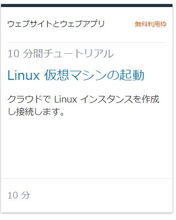
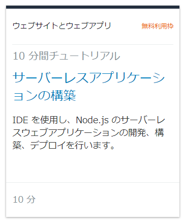
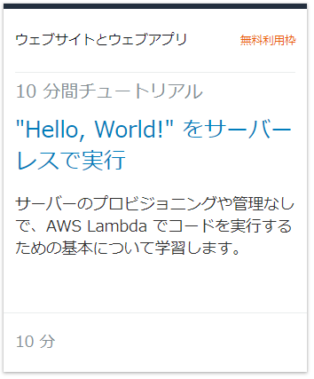

- [Cloud-Computing](#cloud-computing)
  - [Reference](#reference)
  - [特徴](#%e7%89%b9%e5%be%b4)
- [AWS](#aws)
  - [Reference](#reference-1)
  - [Tutorial](#tutorial)
    - [Linux 仮想マシンの起動](#linux-%e4%bb%ae%e6%83%b3%e3%83%9e%e3%82%b7%e3%83%b3%e3%81%ae%e8%b5%b7%e5%8b%95)
      - [利用サービス](#%e5%88%a9%e7%94%a8%e3%82%b5%e3%83%bc%e3%83%93%e3%82%b9)
      - [手順](#%e6%89%8b%e9%a0%86)
        - [下図のチュートリアルを選択する](#%e4%b8%8b%e5%9b%b3%e3%81%ae%e3%83%81%e3%83%a5%e3%83%bc%e3%83%88%e3%83%aa%e3%82%a2%e3%83%ab%e3%82%92%e9%81%b8%e6%8a%9e%e3%81%99%e3%82%8b)
        - [チュートリアルに沿って実施する](#%e3%83%81%e3%83%a5%e3%83%bc%e3%83%88%e3%83%aa%e3%82%a2%e3%83%ab%e3%81%ab%e6%b2%bf%e3%81%a3%e3%81%a6%e5%ae%9f%e6%96%bd%e3%81%99%e3%82%8b)
    - [サーバーレスアプリケーションの構築](#%e3%82%b5%e3%83%bc%e3%83%90%e3%83%bc%e3%83%ac%e3%82%b9%e3%82%a2%e3%83%97%e3%83%aa%e3%82%b1%e3%83%bc%e3%82%b7%e3%83%a7%e3%83%b3%e3%81%ae%e6%a7%8b%e7%af%89)
      - [サービス](#%e3%82%b5%e3%83%bc%e3%83%93%e3%82%b9)
      - [手順](#%e6%89%8b%e9%a0%86-1)
        - [下図のチュートリアルを選択する](#%e4%b8%8b%e5%9b%b3%e3%81%ae%e3%83%81%e3%83%a5%e3%83%bc%e3%83%88%e3%83%aa%e3%82%a2%e3%83%ab%e3%82%92%e9%81%b8%e6%8a%9e%e3%81%99%e3%82%8b-1)
        - [チュートリアルに沿って実施する](#%e3%83%81%e3%83%a5%e3%83%bc%e3%83%88%e3%83%aa%e3%82%a2%e3%83%ab%e3%81%ab%e6%b2%bf%e3%81%a3%e3%81%a6%e5%ae%9f%e6%96%bd%e3%81%99%e3%82%8b-1)
    - ["Hello, World!" をサーバーレスで実行](#%22hello-world%22-%e3%82%92%e3%82%b5%e3%83%bc%e3%83%90%e3%83%bc%e3%83%ac%e3%82%b9%e3%81%a7%e5%ae%9f%e8%a1%8c)
      - [サービス](#%e3%82%b5%e3%83%bc%e3%83%93%e3%82%b9-1)
      - [手順](#%e6%89%8b%e9%a0%86-2)
        - [下図のチュートリアルを選択する](#%e4%b8%8b%e5%9b%b3%e3%81%ae%e3%83%81%e3%83%a5%e3%83%bc%e3%83%88%e3%83%aa%e3%82%a2%e3%83%ab%e3%82%92%e9%81%b8%e6%8a%9e%e3%81%99%e3%82%8b-2)
        - [チュートリアルと画面が異なるため、読み替えながら実施する](#%e3%83%81%e3%83%a5%e3%83%bc%e3%83%88%e3%83%aa%e3%82%a2%e3%83%ab%e3%81%a8%e7%94%bb%e9%9d%a2%e3%81%8c%e7%95%b0%e3%81%aa%e3%82%8b%e3%81%9f%e3%82%81%e8%aa%ad%e3%81%bf%e6%9b%bf%e3%81%88%e3%81%aa%e3%81%8c%e3%82%89%e5%ae%9f%e6%96%bd%e3%81%99%e3%82%8b)
  - [Amazon Sumerian](#amazon-sumerian)
    - [Overview](#overview)
    - [memo](#memo)
  - [AWS CodeStar](#aws-codestar)
    - [Overview](#overview-1)
  - [Amazon DynamoDB](#amazon-dynamodb)
    - [Overview](#overview-2)
    - [memo](#memo-1)

# Cloud-Computing

## Reference
- [大手クラウドサービス3社の違いとは？ GCP 、 AWS 、 Azure の特徴を比較！](https://www.topgate.co.jp/comparison-cloud-services)

## 特徴
- AWS
  - デファクトスタンダード
  - 歴史が長い
  - 製造業以外でよく使われている(イメージ)
- Azure
  - Microsoftとの連携
  - Windows系との親和性
  - 日本企業、かつ、製造業に向いている感
  - Hololens2などのエッジデバイスとの連携
- GCP
  - 一般ユーザが普段から使用しているツールとの親和性
  - 機械学習に強い(イメージ)

# AWS

## Reference
- [大手クラウドサービス3社の違いとは？ GCP 、 AWS 、 Azure の特徴を比較！](https://www.topgate.co.jp/comparison-cloud-services)
- [「AWS is 何」を3行でまとめてみるよ](https://qiita.com/kohashi/items/1bb952313fb695f12577)

## Tutorial
- [aws tutorial site](https://aws.amazon.com/jp/getting-started/tutorials/?awsf.getting-started-content=*all&awsm.page-tutorials-all=1)

### Linux 仮想マシンの起動
#### 利用サービス
- Amazon Elastic Compute Cloud (EC2)
#### 手順
- [tutorial site](https://aws.amazon.com/jp/getting-started/tutorials/launch-a-virtual-machine/?trk=gs_card)
##### 下図のチュートリアルを選択する

##### チュートリアルに沿って実施する

### サーバーレスアプリケーションの構築
#### サービス
- AWS CodeStar
- AWS Cloud9

#### 手順
- [tutorial site](https://aws.amazon.com/jp/getting-started/tutorials/build-serverless-app-codestar-cloud9/?trk=gs_card)
##### 下図のチュートリアルを選択する

##### チュートリアルに沿って実施する

### "Hello, World!" をサーバーレスで実行
#### サービス
- AWS Lambda

#### 手順
- [tutorial site](https://aws.amazon.com/jp/getting-started/tutorials/run-serverless-code/?trk=gs_card)
##### 下図のチュートリアルを選択する

##### チュートリアルと画面が異なるため、読み替えながら実施する

## Amazon Sumerian
### Overview
- [Amazon Sumerian](https://aws.amazon.com/jp/sumerian/)
- VR、AR、3D のコンテンツを短時間で簡単に作成します
### memo
https://us-east-1.sumerian.aws/76c791c96de14bd6ab49017e817c5688.scene

## AWS CodeStar
### Overview
- DevOpsツール
- プロジェクト作成からコード・ビルド・デプロイまで可能

## Amazon DynamoDB
### Overview
- NoSQL データベースサービス
### memo
- リンク
  - [NoSQL テーブルを作成してクエリを実行する](https://aws.amazon.com/jp/getting-started/tutorials/create-nosql-table/?sc_icampaign=acq_tmt_201902_dynamodb&sc_ichannel=ha&sc_icontent=awssm-1814&sc_iplace=2up&trk=ha_awssm_1814_acq_tmt_201902_dynamodb_2up)
  - [DynamoDB SDK の使用開始](https://docs.aws.amazon.com/ja_jp/amazondynamodb/latest/developerguide/GettingStarted.html)
- 疑問
  - RDBとNoSQLの特性の違いは何か
- 所感
  - チュートリアル通り
  - Jsonでデータ管理