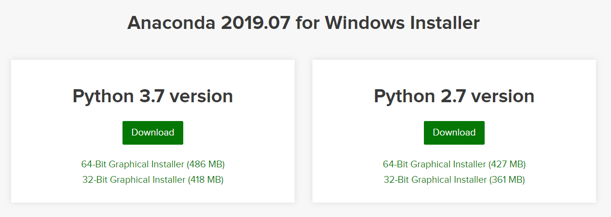
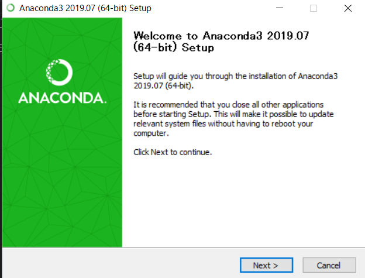
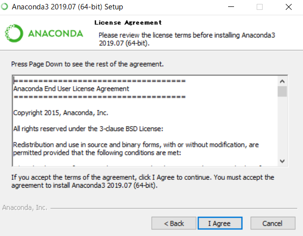
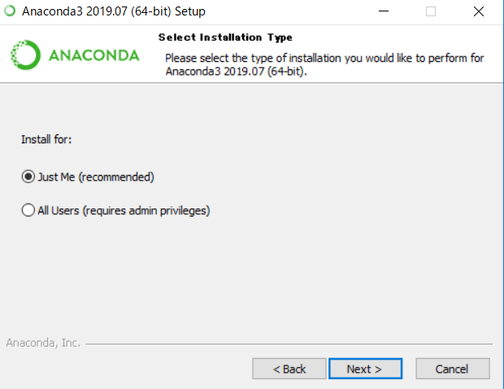
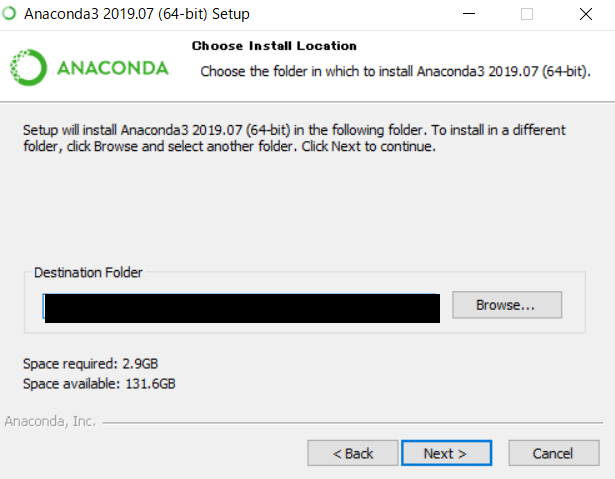
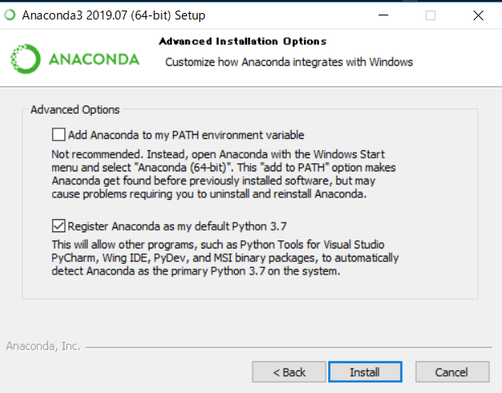
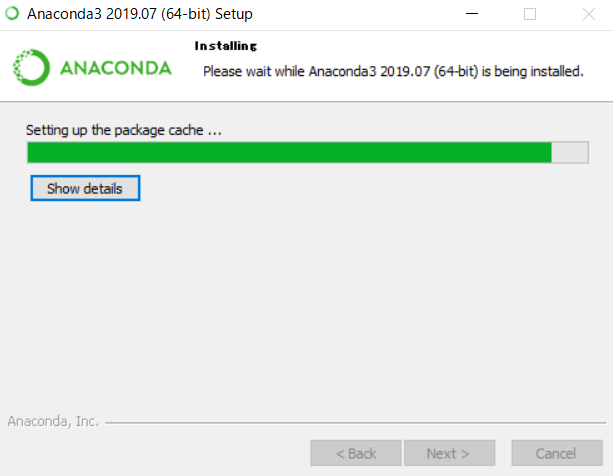

- [セットアップ](#%e3%82%bb%e3%83%83%e3%83%88%e3%82%a2%e3%83%83%e3%83%97)
  - [環境](#%e7%92%b0%e5%a2%83)
  - [Anacoda構築手順](#anacoda%e6%a7%8b%e7%af%89%e6%89%8b%e9%a0%86)
    - [対象](#%e5%af%be%e8%b1%a1)
    - [手順](#%e6%89%8b%e9%a0%86)
      - [ダウンロード](#%e3%83%80%e3%82%a6%e3%83%b3%e3%83%ad%e3%83%bc%e3%83%89)
      - [インストール](#%e3%82%a4%e3%83%b3%e3%82%b9%e3%83%88%e3%83%bc%e3%83%ab)

# セットアップ
## 環境
- OS：Windows 10 Home (64bit)
## Anacoda構築手順
### 対象
- Anaconda
  - Python 3.7 version
### 手順
#### ダウンロード
[Anaconda](https://www.anaconda.com/distribution/)からインストーラーをダウンロード
   - 今回は「Anaconda3-2019.07-Windows-x86_64.exe」

#### インストール
1. 「Next」をクリック

1. 「I Agree」をクリック

1. 下図のとおり選択し、「Next」をクリック

1. デフォルトのまま、「Next」をクリック

1. 下図のとおり選択し、「Install」をクリック

