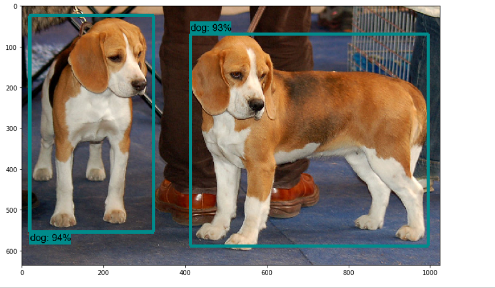

- [Object Detection API](#object-detection-api)
  - [環境](#%e7%92%b0%e5%a2%83)
  - [環境構築(PC)](#%e7%92%b0%e5%a2%83%e6%a7%8b%e7%af%89pc)
    - [TensorFlowのモデルのダウンロード・PYTHONPATHの設定](#tensorflow%e3%81%ae%e3%83%a2%e3%83%87%e3%83%ab%e3%81%ae%e3%83%80%e3%82%a6%e3%83%b3%e3%83%ad%e3%83%bc%e3%83%89%e3%83%bbpythonpath%e3%81%ae%e8%a8%ad%e5%ae%9a)
    - [Protobufのダウンロード](#protobuf%e3%81%ae%e3%83%80%e3%82%a6%e3%83%b3%e3%83%ad%e3%83%bc%e3%83%89)
  - [環境構築(Anaconda)](#%e7%92%b0%e5%a2%83%e6%a7%8b%e7%af%89anaconda)
    - [構築後のライブラリ](#%e6%a7%8b%e7%af%89%e5%be%8c%e3%81%ae%e3%83%a9%e3%82%a4%e3%83%96%e3%83%a9%e3%83%aa)
    - [手順](#%e6%89%8b%e9%a0%86)
  - [実行(Anaconda)](#%e5%ae%9f%e8%a1%8canaconda)
    - [手順](#%e6%89%8b%e9%a0%86-1)
    - [エラー対応（アウトプットが表示されない）](#%e3%82%a8%e3%83%a9%e3%83%bc%e5%af%be%e5%bf%9c%e3%82%a2%e3%82%a6%e3%83%88%e3%83%97%e3%83%83%e3%83%88%e3%81%8c%e8%a1%a8%e7%a4%ba%e3%81%95%e3%82%8c%e3%81%aa%e3%81%84)
  - [補足（jupyter notebook起動）](#%e8%a3%9c%e8%b6%b3jupyter-notebook%e8%b5%b7%e5%8b%95)
  - [参考](#%e5%8f%82%e8%80%83)

# Object Detection API
## 環境
- OS：Windows 10 Home (64bit)
- ツール：Anaconda (Python 3.7 version)
## 環境構築(PC)
### TensorFlowのモデルのダウンロード・PYTHONPATHの設定
- [github](https://github.com/tensorflow/models)から任意のフォルダにcloneする
```
git clone https://github.com/tensorflow/models.git
```

- ユーザ環境変数に下記を新規追加する
  - 変数名：PYTHONPATH
  - 変数値：～\models\research;～\models\research\slim
  - ※環境変数を設定したら、PCを再起動。

### Protobufのダウンロード
- [github](https://github.com/protocolbuffers/protobuf/releases)から「protoc-3.9.1-win64.zip」をダウンロードする
- 展開したフォルダ内の「bin」に入っている「protoc.exe」を、「models-master」内の「research」の中に移動する

## 環境構築(Anaconda)
- 前提：
  -  「Anaconda navigator」で「Enviroment」を作成済
  -  「Anaconda terminal」で以下を実行
- 注意：
  - 下記手順を実施するタイミングによって、各ライブラリのバージョンが変わっている可能性があるため、なるべくバージョン指定で実行する方がよい
### 構築後のライブラリ
```sh
(obj-detect-2) xxxx > conda list
# packages in environment at xxxx\Anaconda3\envs\obj-detect-2:
#
# Name                    Version                   Build  Channel
absl-py                   0.8.0                    pypi_0    pypi
astor                     0.8.0                    pypi_0    pypi
attrs                     19.2.0                   pypi_0    pypi
backcall                  0.1.0                    pypi_0    pypi
bleach                    3.1.0                    pypi_0    pypi
certifi                   2019.9.11                py36_0
colorama                  0.4.1                    pypi_0    pypi
cycler                    0.10.0                   pypi_0    pypi
decorator                 4.4.0                    pypi_0    pypi
defusedxml                0.6.0                    pypi_0    pypi
entrypoints               0.3                      pypi_0    pypi
gast                      0.2.2                    pypi_0    pypi
google-pasta              0.1.7                    pypi_0    pypi
grpcio                    1.24.1                   pypi_0    pypi
h5py                      2.10.0                   pypi_0    pypi
ipykernel                 5.1.2                    pypi_0    pypi
ipython                   7.8.0                    pypi_0    pypi
ipython-genutils          0.2.0                    pypi_0    pypi
ipywidgets                7.5.1                    pypi_0    pypi
jedi                      0.15.1                   pypi_0    pypi
jinja2                    2.10.3                   pypi_0    pypi
jsonschema                3.0.2                    pypi_0    pypi
jupyter                   1.0.0                    pypi_0    pypi
jupyter-client            5.3.3                    pypi_0    pypi
jupyter-console           6.0.0                    pypi_0    pypi
jupyter-core              4.5.0                    pypi_0    pypi
keras-applications        1.0.8                    pypi_0    pypi
keras-preprocessing       1.1.0                    pypi_0    pypi
kiwisolver                1.1.0                    pypi_0    pypi
lxml                      4.4.1                    pypi_0    pypi
markdown                  3.1.1                    pypi_0    pypi
markupsafe                1.1.1                    pypi_0    pypi
matplotlib                3.1.1                    pypi_0    pypi
mistune                   0.8.4                    pypi_0    pypi
nbconvert                 5.6.0                    pypi_0    pypi
nbformat                  4.4.0                    pypi_0    pypi
notebook                  6.0.1                    pypi_0    pypi
numpy                     1.17.2                   pypi_0    pypi
opt-einsum                3.1.0                    pypi_0    pypi
pandocfilters             1.4.2                    pypi_0    pypi
parso                     0.5.1                    pypi_0    pypi
pickleshare               0.7.5                    pypi_0    pypi
pillow                    6.2.0                    pypi_0    pypi
pip                       19.2.3                   py36_0
prometheus-client         0.7.1                    pypi_0    pypi
prompt-toolkit            2.0.10                   pypi_0    pypi
protobuf                  3.10.0                   pypi_0    pypi
pygments                  2.4.2                    pypi_0    pypi
pyparsing                 2.4.2                    pypi_0    pypi
pyrsistent                0.15.4                   pypi_0    pypi
python                    3.6.9                h5500b2f_0
python-dateutil           2.8.0                    pypi_0    pypi
pywin32                   225                      pypi_0    pypi
pywinpty                  0.5.5                    pypi_0    pypi
pyzmq                     18.1.0                   pypi_0    pypi
qtconsole                 4.5.5                    pypi_0    pypi
send2trash                1.5.0                    pypi_0    pypi
setuptools                41.2.0                   py36_0
six                       1.12.0                   pypi_0    pypi
sqlite                    3.30.0               he774522_0
tensorboard               1.14.0                   pypi_0    pypi
tensorflow                1.14.0                   pypi_0    pypi
tensorflow-estimator      1.14.0                   pypi_0    pypi
termcolor                 1.1.0                    pypi_0    pypi
terminado                 0.8.2                    pypi_0    pypi
testpath                  0.4.2                    pypi_0    pypi
tornado                   6.0.3                    pypi_0    pypi
traitlets                 4.3.3                    pypi_0    pypi
vc                        14.1                 h0510ff6_4
vs2015_runtime            14.16.27012          hf0eaf9b_0
wcwidth                   0.1.7                    pypi_0    pypi
webencodings              0.5.1                    pypi_0    pypi
werkzeug                  0.16.0                   pypi_0    pypi
wheel                     0.33.6                   py36_0
widgetsnbextension        3.5.1                    pypi_0    pypi
wincertstore              0.2              py36h7fe50ca_0
wrapt                     1.11.2                   pypi_0    pypi
```

### 手順
- tensorflowのインストール
```sh
# コマンド
pip install tensorflow==1.14
```
```sh
# 結果
～(省略)～

Successfully built opt-einsum gast
Installing collected packages: numpy, opt-einsum, tensorflow-estimator, six, protobuf, absl-py, grpcio, markdown, werkzeug, tensorboard, google-pasta, keras-preprocessing, astor, h5py, keras-applications, termcolor, gast, wrapt, tensorflow
Successfully installed absl-py-0.8.0 astor-0.8.0 gast-0.2.2 google-pasta-0.1.7 grpcio-1.24.1 h5py-2.10.0 keras-applications-1.0.8 keras-preprocessing-1.1.0 markdown-3.1.1 numpy-1.17.2 opt-einsum-3.1.0 protobuf-3.10.0 six-1.12.0 tensorboard-2.0.0 tensorflow-2.0.0 tensorflow-estimator-2.0.0 termcolor-1.1.0 werkzeug-0.16.0 wrapt-1.11.2
```

- Protobuf、Pillow、lxmlのインストール
```sh
# コマンド
pip install Protobuf Pillow lxml
```
```sh
# 結果
～(省略)～

Installing collected packages: Pillow, lxml
Successfully installed Pillow-6.2.0 lxml-4.4.1
```

- Jupyter notebookのインストール
```sh
# コマンド
pip install Jupyter
```
```sh
# 結果
～(省略)～

Successfully installed Jupyter-1.0.0 MarkupSafe-1.1.1 Send2Trash-1.5.0 attrs-19.2.0 backcall-0.1.0 bleach-3.1.0 colorama-0.4.1 decorator-4.4.0 defusedxml-0.6.0 entrypoints-0.3 ipykernel-5.1.2 ipython-7.8.0 ipython-genutils-0.2.0 ipywidgets-7.5.1 jedi-0.15.1 jinja2-2.10.3 jsonschema-3.0.2 jupyter-client-5.3.3 jupyter-console-6.0.0 jupyter-core-4.5.0 mistune-0.8.4 nbconvert-5.6.0 nbformat-4.4.0 notebook-6.0.1 pandocfilters-1.4.2 parso-0.5.1 pickleshare-0.7.5 prometheus-client-0.7.1 prompt-toolkit-2.0.10 pygments-2.4.2 pyrsistent-0.15.4 python-dateutil-2.8.0 pywin32-225 pywinpty-0.5.5 pyzmq-18.1.0 qtconsole-4.5.5 terminado-0.8.2 testpath-0.4.2 tornado-6.0.3 traitlets-4.3.3 wcwidth-0.1.7 webencodings-0.5.1 widgetsnbextension-3.5.1
```

- Matplotlibのインストール
```sh
# コマンド
pip install Matplotlib
```
```sh
# 結果
～(省略)～

Successfully installed Matplotlib-3.1.1 cycler-0.10.0 kiwisolver-1.1.0 pyparsing-2.4.2
```

- Protobufのコンパイル
※tensorflowの「models」の「research」に移動しておく
```sh
# コマンド
protoc object_detection/protos/*.proto --python_out=.
```
```sh
# 結果
object_detection/protos/*.proto: No such file or directory
```

上記エラーは「*.proto」という正規表現がWindowsでできないかららしい。なので、下記のようにすべて直接指定して実行する。

```sh
# コマンド
protoc object_detection/protos/anchor_generator.proto --python_out=.
protoc object_detection/protos/argmax_matcher.proto --python_out=.
protoc object_detection/protos/bipartite_matcher.proto --python_out=.
protoc object_detection/protos/box_coder.proto --python_out=.
protoc object_detection/protos/box_predictor.proto --python_out=.
protoc object_detection/protos/calibration.proto --python_out=.
protoc object_detection/protos/eval.proto --python_out=.
protoc object_detection/protos/faster_rcnn.proto --python_out=.
protoc object_detection/protos/faster_rcnn_box_coder.proto --python_out=.
protoc object_detection/protos/flexible_grid_anchor_generator.proto --python_out=.
protoc object_detection/protos/graph_rewriter.proto --python_out=.
protoc object_detection/protos/grid_anchor_generator.proto --python_out=.
protoc object_detection/protos/hyperparams.proto --python_out=.
protoc object_detection/protos/image_resizer.proto --python_out=.
protoc object_detection/protos/input_reader.proto --python_out=.
protoc object_detection/protos/keypoint_box_coder.proto --python_out=.
protoc object_detection/protos/losses.proto --python_out=.
protoc object_detection/protos/matcher.proto --python_out=.
protoc object_detection/protos/mean_stddev_box_coder.proto --python_out=.
protoc object_detection/protos/model.proto --python_out=.
protoc object_detection/protos/multiscale_anchor_generator.proto --python_out=.
protoc object_detection/protos/optimizer.proto --python_out=.
protoc object_detection/protos/pipeline.proto --python_out=.
protoc object_detection/protos/post_processing.proto --python_out=.
protoc object_detection/protos/preprocessor.proto --python_out=.
protoc object_detection/protos/region_similarity_calculator.proto --python_out=.
protoc object_detection/protos/square_box_coder.proto --python_out=.
protoc object_detection/protos/ssd.proto --python_out=.
protoc object_detection/protos/ssd_anchor_generator.proto --python_out=.
protoc object_detection/protos/string_int_label_map.proto --python_out=.
protoc object_detection/protos/train.proto --python_out=.
```

- 必要なライブラリがインストールできているか「model_builder_test」を実行してチェック
※tensorflowの「models」の「research」に移動しておく
```sh
# コマンド
python object_detection/builders/model_builder_test.py
```
```sh
# 結果
～(省略)～

OK (skipped=1)
```

## 実行(Anaconda)
- 前提：
  -  「Jupyter notebook」で以下を実行
### 手順
jupyter notebookが起動したら、「object_detection_tutorial.ipynb」を選択し、
「Cell」を押して「Run All」をクリック。
下図が表示されたらOK。


### エラー対応（アウトプットが表示されない）
アウトプットが表示されない場合は、下記対応を実施する。
- 「research/object_detection/visualization_utils.py」の下記コードをコメントアウトする
```py
#import matplotlib; matplotlib.use('Agg') # pylint: disable=multiple-statements
#import matplotlib.pyplot as plt # pylint: disable=g-import-not-at-top
```

## 補足（jupyter notebook起動）
※対象のフォルダまで移動しておくと便利
```sh
jupyter notebook
```

## 参考
- [TensorFlow Object Detection APIをWindowsで使ってみた](https://qiita.com/x-lab/items/224e63565ecf1c3109cf)
- [Protobufのコンパイルエラー対応](https://github.com/tensorflow/models/issues/2930)
- [【物体認識】TensorflowのObject Detection APIをWindows ローカルでやるとハマる所【ラジコン自動運転】](https://tom2rd.sakura.ne.jp/wp/2018/02/07/post-6925/)
- [No image shown at the end of running object_detection_tutorial.ipynb](https://github.com/EdjeElectronics/TensorFlow-Object-Detection-API-Tutorial-Train-Multiple-Objects-Windows-10/issues/232)