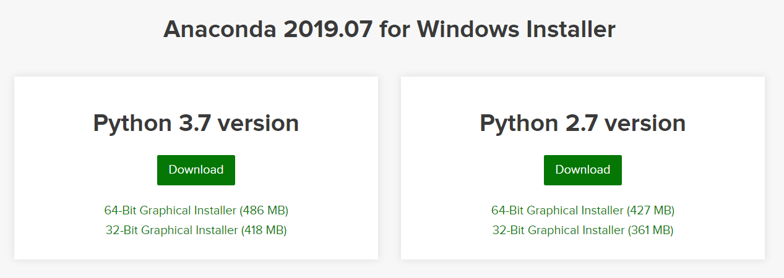
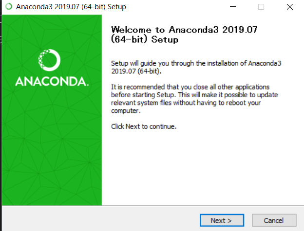
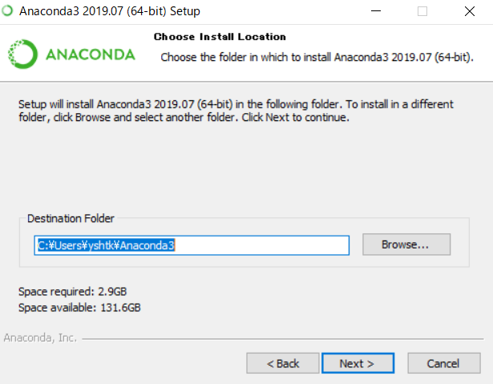
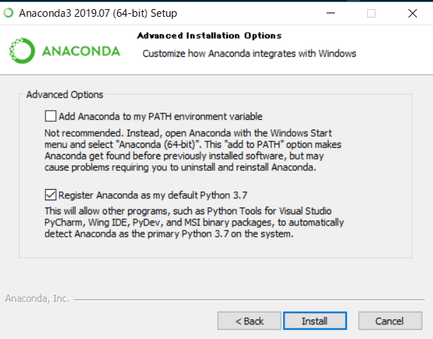
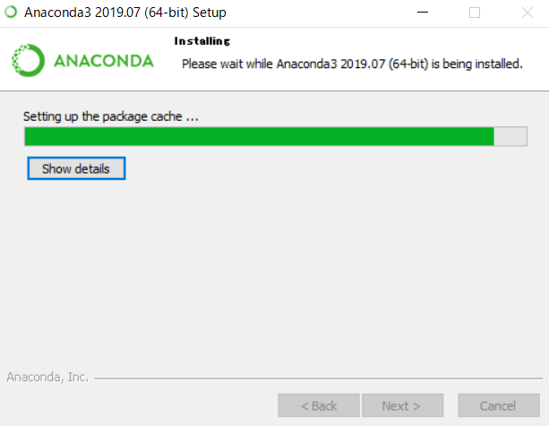
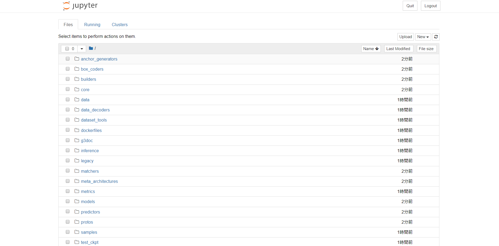

# 環境
- OS：Windows 10 Home (64bit)
- python 3.6

# 環境構築
- [Anaconda](https://www.anaconda.com/distribution/)
- ANACONDAのインストール
- Anaconda3-2019.07-Windows-x86_64.exe








- TensorFlowのモデルをダウンロード
- [github](https://github.com/tensorflow/models)

- Protobufのダウンロード
- [github](https://github.com/protocolbuffers/protobuf/releases)
- protoc-3.9.1-win64.zip

- PYTHONPATHの設定
- ユーザ環境変数で新規をクリック
- 変数値にはmodels-master内のresearchと、さらにその中のslimの二ヵ所に設定

# Anaconda navigator上での操作
- Anaconda navigatorの起動
- 実行環境の構築
- tensorflowのインストール
- anaconda terminal
```sh
#コマンド
pip install tensorflow
```
```sh
#実行結果
Collecting tensorflow
  Downloading https://files.pythonhosted.org/packages/bf/4a/5c86ed8b245aa48f9f819b13a0a9039e9126ba19fdd0c7e0b8026c12315a/tensorflow-1.14.0-cp36-cp36m-win_amd64.whl (68.3MB)

~~~~~

Successfully built termcolor wrapt gast absl-py
Installing collected packages: numpy, six, h5py, keras-applications, keras-preprocessing, protobuf, termcolor, wrapt, google-pasta, grpcio, gast, absl-py, werkzeug, markdown, tensorboard, astor, tensorflow-estimator, tensorflow
Successfully installed absl-py-0.8.0 astor-0.8.0 gast-0.3.1 google-pasta-0.1.7 grpcio-1.23.0 h5py-2.10.0 keras-applications-1.0.8 keras-preprocessing-1.1.0 markdown-3.1.1 numpy-1.17.2 protobuf-3.9.1 six-1.12.0 tensorboard-1.14.0 tensorflow-1.14.0 tensorflow-estimator-1.14.0 termcolor-1.1.0 werkzeug-0.15.6 wrapt-1.11.2
```
- ライブラリのインストール
```sh
#コマンド
pip install Protobuf Pillow lxml
```
```sh
#実行結果
Requirement already satisfied: Protobuf in c:\users\yshtk\anaconda3\envs\obj-detect\lib\site-packages (3.9.1)
Collecting Pillow
  Downloading https://files.pythonhosted.org/packages/4e/d9/468422371e6fcf02d6a162ee30db4552221de8b2b3ff837363bf54cbb347/Pillow-6.1.0-cp36-cp36m-win_amd64.whl (2.0MB)
     |████████████████████████████████| 2.0MB 226kB/s
Collecting lxml
  Downloading https://files.pythonhosted.org/packages/6f/6d/d54317403070fcaae973f38b9c298e4b4c101b469ae51afa7c1370e5c35b/lxml-4.4.1-cp36-cp36m-win_amd64.whl (3.7MB)
     |████████████████████████████████| 3.7MB 242kB/s
Requirement already satisfied: setuptools in c:\users\yshtk\anaconda3\envs\obj-detect\lib\site-packages (from Protobuf) (41.0.1)
Requirement already satisfied: six>=1.9 in c:\users\yshtk\anaconda3\envs\obj-detect\lib\site-packages (from Protobuf) (1.12.0)
Installing collected packages: Pillow, lxml
Successfully installed Pillow-6.1.0 lxml-4.4.1
```
```sh
#コマンド
pip install Jupyter
```
```sh
#実行結果
Collecting Jupyter
  Downloading https://files.pythonhosted.org/packages/83/df/0f5dd132200728a86190397e1ea87cd76244e42d39ec5e88efd25b2abd7e/jupyter-1.0.0-py2.py3-none-any.whl

~~~~~

Successfully built prometheus-client pandocfilters backcall pyrsistent
Installing collected packages: ipython-genutils, decorator, traitlets, jupyter-core, tornado, python-dateutil, pyzmq, jupyter-client, pywinpty, terminado, prometheus-client, pickleshare, wcwidth, prompt-toolkit, backcall, pygments, colorama, parso, jedi, ipython, ipykernel, pyrsistent, attrs, jsonschema, nbformat, MarkupSafe, jinja2, defusedxml, testpath, webencodings, bleach, pandocfilters, entrypoints, mistune, nbconvert, Send2Trash, notebook, jupyter-console, widgetsnbextension, ipywidgets, qtconsole, Jupyter
Successfully installed Jupyter-1.0.0 MarkupSafe-1.1.1 Send2Trash-1.5.0 attrs-19.1.0 backcall-0.1.0 bleach-3.1.0 colorama-0.4.1 decorator-4.4.0 defusedxml-0.6.0 entrypoints-0.3 ipykernel-5.1.2 ipython-7.8.0 ipython-genutils-0.2.0 ipywidgets-7.5.1 jedi-0.15.1 jinja2-2.10.1 jsonschema-3.0.2 jupyter-client-5.3.1 jupyter-console-6.0.0 jupyter-core-4.5.0 mistune-0.8.4 nbconvert-5.6.0 nbformat-4.4.0 notebook-6.0.1 pandocfilters-1.4.2 parso-0.5.1 pickleshare-0.7.5 prometheus-client-0.7.1 prompt-toolkit-2.0.9 pygments-2.4.2 pyrsistent-0.15.4 python-dateutil-2.8.0 pywinpty-0.5.5 pyzmq-18.1.0 qtconsole-4.5.5 terminado-0.8.2 testpath-0.4.2 tornado-6.0.3 traitlets-4.3.2 wcwidth-0.1.7 webencodings-0.5.1 widgetsnbextension-3.5.1
```
```sh
#コマンド
pip install Matplotlib
```
```sh
#実行結果
Collecting Matplotlib
  Downloading https://files.pythonhosted.org/packages/cc/eb/fd7a5f3c1484e8d2590ff94ca0b89941940a916394f719ab3bb7279e1970/matplotlib-3.1.1-cp36-cp36m-win_amd64.whl (9.1MB)
     |████████████████████████████████| 9.1MB 284kB/s
Collecting cycler>=0.10 (from Matplotlib)
  Downloading https://files.pythonhosted.org/packages/f7/d2/e07d3ebb2bd7af696440ce7e754c59dd546ffe1bbe732c8ab68b9c834e61/cycler-0.10.0-py2.py3-none-any.whl
Requirement already satisfied: python-dateutil>=2.1 in c:\users\yshtk\anaconda3\envs\obj-detect\lib\site-packages (from Matplotlib) (2.8.0)
Collecting kiwisolver>=1.0.1 (from Matplotlib)
  Downloading https://files.pythonhosted.org/packages/64/46/75ab48386cbd56065f5542360562be524ad599911455b6d95520cb118613/kiwisolver-1.1.0-cp36-none-win_amd64.whl (57kB)
     |████████████████████████████████| 61kB 328kB/s
Requirement already satisfied: numpy>=1.11 in c:\users\yshtk\anaconda3\envs\obj-detect\lib\site-packages (from Matplotlib) (1.17.2)
Collecting pyparsing!=2.0.4,!=2.1.2,!=2.1.6,>=2.0.1 (from Matplotlib)
  Downloading https://files.pythonhosted.org/packages/11/fa/0160cd525c62d7abd076a070ff02b2b94de589f1a9789774f17d7c54058e/pyparsing-2.4.2-py2.py3-none-any.whl (65kB)
     |████████████████████████████████| 71kB 918kB/s
Requirement already satisfied: six in c:\users\yshtk\anaconda3\envs\obj-detect\lib\site-packages (from cycler>=0.10->Matplotlib) (1.12.0)
Requirement already satisfied: setuptools in c:\users\yshtk\anaconda3\envs\obj-detect\lib\site-packages (from kiwisolver>=1.0.1->Matplotlib) (41.0.1)
Installing collected packages: cycler, kiwisolver, pyparsing, Matplotlib
Successfully installed Matplotlib-3.1.1 cycler-0.10.0 kiwisolver-1.1.0 pyparsing-2.4.2
```

- Protobufのコンパイル
```sh
#コマンド
cd C:\Users\yshtk\Desktop\AnacondaProjects\models\research
```
```sh
#実行結果なし
```
```sh
#コマンド
protoc object_detection/protos/anchor_generator.proto --python_out=.
protoc object_detection/protos/argmax_matcher.proto --python_out=.
protoc object_detection/protos/bipartite_matcher.proto --python_out=.
protoc object_detection/protos/box_coder.proto --python_out=.
protoc object_detection/protos/box_predictor.proto --python_out=.
protoc object_detection/protos/calibration.proto --python_out=.
protoc object_detection/protos/eval.proto --python_out=.
protoc object_detection/protos/faster_rcnn.proto --python_out=.
protoc object_detection/protos/faster_rcnn_box_coder.proto --python_out=.
protoc object_detection/protos/flexible_grid_anchor_generator.proto --python_out=.
protoc object_detection/protos/graph_rewriter.proto --python_out=.
protoc object_detection/protos/grid_anchor_generator.proto --python_out=.
protoc object_detection/protos/hyperparams.proto --python_out=.
protoc object_detection/protos/image_resizer.proto --python_out=.
protoc object_detection/protos/input_reader.proto --python_out=.
protoc object_detection/protos/keypoint_box_coder.proto --python_out=.
protoc object_detection/protos/losses.proto --python_out=.
protoc object_detection/protos/matcher.proto --python_out=.
protoc object_detection/protos/mean_stddev_box_coder.proto --python_out=.
protoc object_detection/protos/model.proto --python_out=.
protoc object_detection/protos/multiscale_anchor_generator.proto --python_out=.
protoc object_detection/protos/optimizer.proto --python_out=.
protoc object_detection/protos/pipeline.proto --python_out=.
protoc object_detection/protos/post_processing.proto --python_out=.
protoc object_detection/protos/preprocessor.proto --python_out=.
protoc object_detection/protos/region_similarity_calculator.proto --python_out=.
protoc object_detection/protos/square_box_coder.proto --python_out=.
protoc object_detection/protos/ssd.proto --python_out=.
protoc object_detection/protos/ssd_anchor_generator.proto --python_out=.
protoc object_detection/protos/string_int_label_map.proto --python_out=.
protoc object_detection/protos/train.proto --python_out=.
```
```sh
#実行結果なし
```
- テスト
```sh
#コマンド
python object_detection/builders/model_builder_test.py
```
```sh
#実行結果
C:\Users\yshtk\Anaconda3\envs\obj-detect\lib\site-packages\tensorflow\python\framework\dtypes.py:516: FutureWarning: Passing (type, 1) or '1type' as a synonym of type is deprecated; in a future version of numpy, it will be understood as (type, (1,)) / '(1,)type'.
  _np_qint8 = np.dtype([("qint8", np.int8, 1)])

~~~~

Running tests under Python 3.6.9: C:\Users\yshtk\Anaconda3\envs\obj-detect\python.exe
[ RUN      ] ModelBuilderTest.test_create_faster_rcnn_model_from_config_with_example_miner
[       OK ] ModelBuilderTest.test_create_faster_rcnn_model_from_config_with_example_miner
[ RUN      ] ModelBuilderTest.test_create_faster_rcnn_models_from_config_faster_rcnn_with_matmul
[       OK ] ModelBuilderTest.test_create_faster_rcnn_models_from_config_faster_rcnn_with_matmul
[ RUN      ] ModelBuilderTest.test_create_faster_rcnn_models_from_config_faster_rcnn_without_matmul
[       OK ] ModelBuilderTest.test_create_faster_rcnn_models_from_config_faster_rcnn_without_matmul
[ RUN      ] ModelBuilderTest.test_create_faster_rcnn_models_from_config_mask_rcnn_with_matmul
[       OK ] ModelBuilderTest.test_create_faster_rcnn_models_from_config_mask_rcnn_with_matmul
[ RUN      ] ModelBuilderTest.test_create_faster_rcnn_models_from_config_mask_rcnn_without_matmul
[       OK ] ModelBuilderTest.test_create_faster_rcnn_models_from_config_mask_rcnn_without_matmul
[ RUN      ] ModelBuilderTest.test_create_rfcn_model_from_config
[       OK ] ModelBuilderTest.test_create_rfcn_model_from_config
[ RUN      ] ModelBuilderTest.test_create_ssd_fpn_model_from_config
[       OK ] ModelBuilderTest.test_create_ssd_fpn_model_from_config
[ RUN      ] ModelBuilderTest.test_create_ssd_models_from_config
[       OK ] ModelBuilderTest.test_create_ssd_models_from_config
[ RUN      ] ModelBuilderTest.test_invalid_faster_rcnn_batchnorm_update
[       OK ] ModelBuilderTest.test_invalid_faster_rcnn_batchnorm_update
[ RUN      ] ModelBuilderTest.test_invalid_first_stage_nms_iou_threshold
[       OK ] ModelBuilderTest.test_invalid_first_stage_nms_iou_threshold
[ RUN      ] ModelBuilderTest.test_invalid_model_config_proto
[       OK ] ModelBuilderTest.test_invalid_model_config_proto
[ RUN      ] ModelBuilderTest.test_invalid_second_stage_batch_size
[       OK ] ModelBuilderTest.test_invalid_second_stage_batch_size
[ RUN      ] ModelBuilderTest.test_session
[  SKIPPED ] ModelBuilderTest.test_session
[ RUN      ] ModelBuilderTest.test_unknown_faster_rcnn_feature_extractor
[       OK ] ModelBuilderTest.test_unknown_faster_rcnn_feature_extractor
[ RUN      ] ModelBuilderTest.test_unknown_meta_architecture
[       OK ] ModelBuilderTest.test_unknown_meta_architecture
[ RUN      ] ModelBuilderTest.test_unknown_ssd_feature_extractor
[       OK ] ModelBuilderTest.test_unknown_ssd_feature_extractor
----------------------------------------------------------------------
Ran 16 tests in 0.138s

OK (skipped=1)
```

# Object Detection APIの実行
- jupyter notebookの起動
```sh
#コマンド
cd object_detection
```
```sh
#実行結果なし
```
```sh
#コマンド
jupyter notebook
```


- 実行
- memo1：アウトプットが表示されない件
> I have met this issue too, I have find a way in google, please comment out the matplotlib importing in the research/object_detection/visualization_utils.py as a temporary fix,
> #import matplotlib; matplotlib.use('Agg') # pylint: disable=multiple-statements
> #import matplotlib.pyplot as plt # pylint: disable=g-import-not-at-top


# opencv
```sh
#コマンド
pip install opencv-python
```
```sh
#実行結果
Collecting opencv-python
  Downloading https://files.pythonhosted.org/packages/9c/88/06cdc6239013e13aec97f474638fc4e7c00e5b7fb954a1d0ec2a5fc8db7a/opencv_python-4.1.1.26-cp36-cp36m-win_amd64.whl (39.0MB)
     |████████████████████████████████| 39.0MB 2.2MB/s
Requirement already satisfied: numpy>=1.11.3 in c:\users\yshtk\anaconda3\envs\obj-detect\lib\site-packages (from opencv-python) (1.17.2)
Installing collected packages: opencv-python
Successfully installed opencv-python-4.1.1.26
```
```sh
#コマンド
pip install opencv-contrib-python
```
```sh
#実行結果
Collecting opencv-contrib-python
  Downloading https://files.pythonhosted.org/packages/ba/0d/40121ed697f6105b9ffafc0e455e955ba8cbff2dda239cf188d24525be5b/opencv_contrib_python-4.1.1.26-cp36-cp36m-win_amd64.whl (45.4MB)
     |████████████████████████████████| 45.4MB 6.8MB/s
Requirement already satisfied: numpy>=1.11.3 in c:\users\yshtk\anaconda3\envs\obj-detect\lib\site-packages (from opencv-contrib-python) (1.17.2)
Installing collected packages: opencv-contrib-python
Successfully installed opencv-contrib-python-4.1.1.26
```


# reference
- [TensorFlow Object Detection APIをWindowsで使ってみた](https://qiita.com/x-lab/items/224e63565ecf1c3109cf)
- [PythonでOpenCVをはじめる（Windows10、Anaconda 2018.12、Python3.7.1、OpenCV4.0.0）](https://qiita.com/SatoshiGachiFujimoto/items/94da93f88578b87f6a89)
- [Detect Objects Using Your Webcam](https://tensorflow-object-detection-api-tutorial.readthedocs.io/en/latest/camera.html)
- [【物体検出】vol.1 ：Windowsでディープラーニング！Darknet YOLOv3（AlexeyAB Darknet）](https://www.nakasha.co.jp/future/ai/windowsdarknet_yolov3alexeyab_darknet.html)
- [学習済みの一般物体検出（SSD）をローカルPC上で動かしてみた](https://masaeng.hatenablog.com/entry/2019/02/24/223153)
- [Windows10環境でAnaconda、Pycharmインストール・設定トライ（１）](https://qiita.com/suJiJi/items/665f24b823506df0b5ab)
- [Python + OpenCV で雑コラ動画を作成する① 顔認識](https://qiita.com/k_sui_14/items/5386db1a118103b1828f)
- [pythonのOpenCVでリアルタイムに笑い男](https://blanktar.jp/blog/2015/02/python-opencv-realtime-lauhgingman.html)