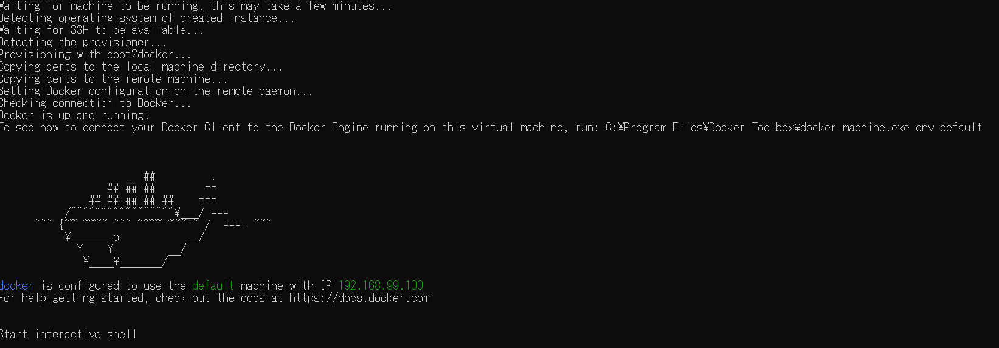

- [セットアップ](#%e3%82%bb%e3%83%83%e3%83%88%e3%82%a2%e3%83%83%e3%83%97)
  - [環境](#%e7%92%b0%e5%a2%83)
  - [Docker構築手順](#docker%e6%a7%8b%e7%af%89%e6%89%8b%e9%a0%86)
    - [対象](#%e5%af%be%e8%b1%a1)
    - [手順](#%e6%89%8b%e9%a0%86)
      - [Docker Toolbox インストール](#docker-toolbox-%e3%82%a4%e3%83%b3%e3%82%b9%e3%83%88%e3%83%bc%e3%83%ab)
      - [Docker Toolbox インストール確認](#docker-toolbox-%e3%82%a4%e3%83%b3%e3%82%b9%e3%83%88%e3%83%bc%e3%83%ab%e7%a2%ba%e8%aa%8d)
- [参考](#%e5%8f%82%e8%80%83)

# セットアップ
## 環境
- OS：Windows 10 Home (64bit)
## Docker構築手順
### 対象
- Docker Toolbox
### 手順
#### Docker Toolbox インストール
※[Install Docker Toolbox on Windows](https://docs.docker.com/toolbox/toolbox_install_windows/)通りに実行する
- [Docker Toolbox](https://docs.docker.com/toolbox/overview/)からインストーラーをダウンロード


- 「DockerToolbox-19.03.1.exe」を実行

- 「Next」をクリック


- 「Next」をクリック


- 「Next」をクリック


- 「Next」をクリック


- 「Install」をクリック


- 「インストール」をクリック


- 「Finish」をクリック


#### Docker Toolbox インストール確認
- 「Docker QuickStart Terminal 」を実行
 - 途中でVitual boxのポップアップがでるのでOKを押す


- クジラのマークがでたら完了



- 補足で「docker run hello-world」を実行して動作するか確認

```sh
$ docker run hello-world
Unable to find image 'hello-world:latest' locally
latest: Pulling from library/hello-world
1b930d010525: Pull complete
Digest: sha256:c3b4ada4687bbaa170745b3e4dd8ac3f194ca95b2d0518b417fb47e5879d9b5f
Status: Downloaded newer image for hello-world:latest

Hello from Docker!
This message shows that your installation appears to be working correctly.

To generate this message, Docker took the following steps:
 1. The Docker client contacted the Docker daemon.
 2. The Docker daemon pulled the "hello-world" image from the Docker Hub.
    (amd64)
 3. The Docker daemon created a new container from that image which runs the
    executable that produces the output you are currently reading.
 4. The Docker daemon streamed that output to the Docker client, which sent it
    to your terminal.

To try something more ambitious, you can run an Ubuntu container with:
 $ docker run -it ubuntu bash

Share images, automate workflows, and more with a free Docker ID:
 https://hub.docker.com/

For more examples and ideas, visit:
 https://docs.docker.com/get-started/
```

# 参考
- [windows 10 home で docker を導入するメモ](https://qiita.com/idani/items/fb7681d79eeb48c05144)