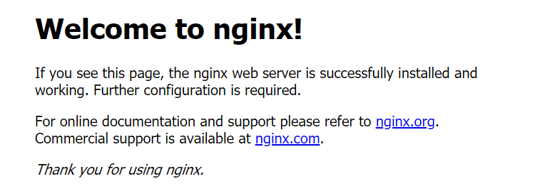

- [{AWS EC2 Linux で Docker と Docker Compose を利用する方法}](#aws-ec2-linux-%e3%81%a7-docker-%e3%81%a8-docker-compose-%e3%82%92%e5%88%a9%e7%94%a8%e3%81%99%e3%82%8b%e6%96%b9%e6%b3%95)
- [はじめに](#%e3%81%af%e3%81%98%e3%82%81%e3%81%ab)
  - [背景](#%e8%83%8c%e6%99%af)
  - [目的](#%e7%9b%ae%e7%9a%84)
- [開発環境](#%e9%96%8b%e7%99%ba%e7%92%b0%e5%a2%83)
  - [セットアップ](#%e3%82%bb%e3%83%83%e3%83%88%e3%82%a2%e3%83%83%e3%83%97)
    - [前提](#%e5%89%8d%e6%8f%90)
    - [Dockerインストール手順](#docker%e3%82%a4%e3%83%b3%e3%82%b9%e3%83%88%e3%83%bc%e3%83%ab%e6%89%8b%e9%a0%86)
      - [Linuxリポジトリを最新化する](#linux%e3%83%aa%e3%83%9d%e3%82%b8%e3%83%88%e3%83%aa%e3%82%92%e6%9c%80%e6%96%b0%e5%8c%96%e3%81%99%e3%82%8b)
      - [Dockerをインストールする](#docker%e3%82%92%e3%82%a4%e3%83%b3%e3%82%b9%e3%83%88%e3%83%bc%e3%83%ab%e3%81%99%e3%82%8b)
      - [Dockerを起動する](#docker%e3%82%92%e8%b5%b7%e5%8b%95%e3%81%99%e3%82%8b)
      - [Dockerをホスト側でいつも起動している状態にする](#docker%e3%82%92%e3%83%9b%e3%82%b9%e3%83%88%e5%81%b4%e3%81%a7%e3%81%84%e3%81%a4%e3%82%82%e8%b5%b7%e5%8b%95%e3%81%97%e3%81%a6%e3%81%84%e3%82%8b%e7%8a%b6%e6%85%8b%e3%81%ab%e3%81%99%e3%82%8b)
      - [ec2-userにDocker起動の権限を付与する(sudoなしでDockerコマンドが実行可能とする)](#ec2-user%e3%81%abdocker%e8%b5%b7%e5%8b%95%e3%81%ae%e6%a8%a9%e9%99%90%e3%82%92%e4%bb%98%e4%b8%8e%e3%81%99%e3%82%8bsudo%e3%81%aa%e3%81%97%e3%81%a7docker%e3%82%b3%e3%83%9e%e3%83%b3%e3%83%89%e3%81%8c%e5%ae%9f%e8%a1%8c%e5%8f%af%e8%83%bd%e3%81%a8%e3%81%99%e3%82%8b)
      - [Dockerを再起動する](#docker%e3%82%92%e5%86%8d%e8%b5%b7%e5%8b%95%e3%81%99%e3%82%8b)
      - [AWSへ再ログインする](#aws%e3%81%b8%e5%86%8d%e3%83%ad%e3%82%b0%e3%82%a4%e3%83%b3%e3%81%99%e3%82%8b)
      - [Dockerの情報を確認する ＋ sudoなしでDockerコマンドが実行できるか確認する](#docker%e3%81%ae%e6%83%85%e5%a0%b1%e3%82%92%e7%a2%ba%e8%aa%8d%e3%81%99%e3%82%8b-%ef%bc%8b-sudo%e3%81%aa%e3%81%97%e3%81%a7docker%e3%82%b3%e3%83%9e%e3%83%b3%e3%83%89%e3%81%8c%e5%ae%9f%e8%a1%8c%e3%81%a7%e3%81%8d%e3%82%8b%e3%81%8b%e7%a2%ba%e8%aa%8d%e3%81%99%e3%82%8b)
    - [Docker Composeインストール手順](#docker-compose%e3%82%a4%e3%83%b3%e3%82%b9%e3%83%88%e3%83%bc%e3%83%ab%e6%89%8b%e9%a0%86)
      - [docker-composeをインストールする](#docker-compose%e3%82%92%e3%82%a4%e3%83%b3%e3%82%b9%e3%83%88%e3%83%bc%e3%83%ab%e3%81%99%e3%82%8b)
      - [docker-composeの実行権限を付与する](#docker-compose%e3%81%ae%e5%ae%9f%e8%a1%8c%e6%a8%a9%e9%99%90%e3%82%92%e4%bb%98%e4%b8%8e%e3%81%99%e3%82%8b)
      - [docker-composeの情報を確認する ＋ sudoなしでDockerコマンドが実行できるか確認する](#docker-compose%e3%81%ae%e6%83%85%e5%a0%b1%e3%82%92%e7%a2%ba%e8%aa%8d%e3%81%99%e3%82%8b-%ef%bc%8b-sudo%e3%81%aa%e3%81%97%e3%81%a7docker%e3%82%b3%e3%83%9e%e3%83%b3%e3%83%89%e3%81%8c%e5%ae%9f%e8%a1%8c%e3%81%a7%e3%81%8d%e3%82%8b%e3%81%8b%e7%a2%ba%e8%aa%8d%e3%81%99%e3%82%8b)
  - [操作](#%e6%93%8d%e4%bd%9c)
    - [Docker基本手順(例：nginxイメージの起動)](#docker%e5%9f%ba%e6%9c%ac%e6%89%8b%e9%a0%86%e4%be%8bnginx%e3%82%a4%e3%83%a1%e3%83%bc%e3%82%b8%e3%81%ae%e8%b5%b7%e5%8b%95)
      - [DockerHubからDockerイメージをダウンロードする](#dockerhub%e3%81%8b%e3%82%89docker%e3%82%a4%e3%83%a1%e3%83%bc%e3%82%b8%e3%82%92%e3%83%80%e3%82%a6%e3%83%b3%e3%83%ad%e3%83%bc%e3%83%89%e3%81%99%e3%82%8b)
      - [Dockerイメージがダウンロードされているか確認する](#docker%e3%82%a4%e3%83%a1%e3%83%bc%e3%82%b8%e3%81%8c%e3%83%80%e3%82%a6%e3%83%b3%e3%83%ad%e3%83%bc%e3%83%89%e3%81%95%e3%82%8c%e3%81%a6%e3%81%84%e3%82%8b%e3%81%8b%e7%a2%ba%e8%aa%8d%e3%81%99%e3%82%8b)
      - [Dockerイメージからコンテナを起動する](#docker%e3%82%a4%e3%83%a1%e3%83%bc%e3%82%b8%e3%81%8b%e3%82%89%e3%82%b3%e3%83%b3%e3%83%86%e3%83%8a%e3%82%92%e8%b5%b7%e5%8b%95%e3%81%99%e3%82%8b)
      - [コンテナの状況を確認する](#%e3%82%b3%e3%83%b3%e3%83%86%e3%83%8a%e3%81%ae%e7%8a%b6%e6%b3%81%e3%82%92%e7%a2%ba%e8%aa%8d%e3%81%99%e3%82%8b)
      - [コンテナへアクセスする(コンテナで起動しているアプリへアクセス)](#%e3%82%b3%e3%83%b3%e3%83%86%e3%83%8a%e3%81%b8%e3%82%a2%e3%82%af%e3%82%bb%e3%82%b9%e3%81%99%e3%82%8b%e3%82%b3%e3%83%b3%e3%83%86%e3%83%8a%e3%81%a7%e8%b5%b7%e5%8b%95%e3%81%97%e3%81%a6%e3%81%84%e3%82%8b%e3%82%a2%e3%83%97%e3%83%aa%e3%81%b8%e3%82%a2%e3%82%af%e3%82%bb%e3%82%b9)
    - [Docker Compose基本手順](#docker-compose%e5%9f%ba%e6%9c%ac%e6%89%8b%e9%a0%86)
      - [Docker Compose実施用のディレクトリを作成する](#docker-compose%e5%ae%9f%e6%96%bd%e7%94%a8%e3%81%ae%e3%83%87%e3%82%a3%e3%83%ac%e3%82%af%e3%83%88%e3%83%aa%e3%82%92%e4%bd%9c%e6%88%90%e3%81%99%e3%82%8b)
      - [ディレクトリ内に「app.py」ファイルを作成する](#%e3%83%87%e3%82%a3%e3%83%ac%e3%82%af%e3%83%88%e3%83%aa%e5%86%85%e3%81%abapppy%e3%83%95%e3%82%a1%e3%82%a4%e3%83%ab%e3%82%92%e4%bd%9c%e6%88%90%e3%81%99%e3%82%8b)
      - [ディレクトリ内に「requirements.txt」ファイルを作成する](#%e3%83%87%e3%82%a3%e3%83%ac%e3%82%af%e3%83%88%e3%83%aa%e5%86%85%e3%81%abrequirementstxt%e3%83%95%e3%82%a1%e3%82%a4%e3%83%ab%e3%82%92%e4%bd%9c%e6%88%90%e3%81%99%e3%82%8b)
      - [ディレクトリ内に「Dockerfile」ファイルを作成する](#%e3%83%87%e3%82%a3%e3%83%ac%e3%82%af%e3%83%88%e3%83%aa%e5%86%85%e3%81%abdockerfile%e3%83%95%e3%82%a1%e3%82%a4%e3%83%ab%e3%82%92%e4%bd%9c%e6%88%90%e3%81%99%e3%82%8b)
      - [DockerfileからDockerイメージを作成する](#dockerfile%e3%81%8b%e3%82%89docker%e3%82%a4%e3%83%a1%e3%83%bc%e3%82%b8%e3%82%92%e4%bd%9c%e6%88%90%e3%81%99%e3%82%8b)
      - [ディレクトリ内に「docker-compose.yml」ファイルを作成する](#%e3%83%87%e3%82%a3%e3%83%ac%e3%82%af%e3%83%88%e3%83%aa%e5%86%85%e3%81%abdocker-composeyml%e3%83%95%e3%82%a1%e3%82%a4%e3%83%ab%e3%82%92%e4%bd%9c%e6%88%90%e3%81%99%e3%82%8b)
      - [Docker Composeで各コンテナを起動する](#docker-compose%e3%81%a7%e5%90%84%e3%82%b3%e3%83%b3%e3%83%86%e3%83%8a%e3%82%92%e8%b5%b7%e5%8b%95%e3%81%99%e3%82%8b)
      - [コンテナへアクセスする(コンテナで起動しているアプリへアクセス)](#%e3%82%b3%e3%83%b3%e3%83%86%e3%83%8a%e3%81%b8%e3%82%a2%e3%82%af%e3%82%bb%e3%82%b9%e3%81%99%e3%82%8b%e3%82%b3%e3%83%b3%e3%83%86%e3%83%8a%e3%81%a7%e8%b5%b7%e5%8b%95%e3%81%97%e3%81%a6%e3%81%84%e3%82%8b%e3%82%a2%e3%83%97%e3%83%aa%e3%81%b8%e3%82%a2%e3%82%af%e3%82%bb%e3%82%b9-1)
  - [終わりに](#%e7%b5%82%e3%82%8f%e3%82%8a%e3%81%ab)
  - [参考](#%e5%8f%82%e8%80%83)

# {AWS EC2 Linux で Docker と Docker Compose を利用する方法}

# はじめに
## 背景
Dockerを名前だけ知っている状態から使える状態にしたい、いや、今後のITに関わっていく身として使える状態にするべきと感じたため。

## 目的
Dockerを使える、以上。

# 開発環境
- AWS EC2 Amazon Linux 2 AMI (HVM), SSD Volume Type
- windows 10 home
- Git Bash

※Dockerを実行する環境はAWS、AWSにつなぐ環境としてWindows・Git Bash

## セットアップ
セットアップ実行による各環境の状態の概要イメージ図は下記となる(自分の脳内イメージ)

インストール前

Dockerインストール後

Docker Composeインストール後


### 前提
- AWSのアカウントを持っていること(EC2サービスを利用するため)
  - [AWS Linux 仮想マシンの起動](https://aws.amazon.com/jp/getting-started/tutorials/launch-a-virtual-machine/?trk=gs_card)
- DockerHubのアカウントを持っていること(最終的にDockerHubへpushまで行うため)
  - [Docker Hub](https://hub.docker.com/)
- AWS EC2へ接続していること
  - Git BashでAWS EC2へssh接続する(下記コマンドで接続)
```sh
#コマンド
ssh -i '{キーペア}' ec2-user@{IPv4 パブリック IP}
```
```sh
#結果
Last login: Sun Aug  4 11:37:01 2019 from pl73134.ag1001.nttpc.ne.jp

       __|  __|_  )
       _|  (     /   Amazon Linux 2 AMI
      ___|\___|___|

https://aws.amazon.com/amazon-linux-2/          
```

### Dockerインストール手順
#### Linuxリポジトリを最新化する
```sh
#コマンド
sudo yum -y update
```
```sh
#実行結果
Loaded plugins: extras_suggestions, langpacks, priorities, update-motd
amzn2-core                                                   

~(省略)~

Complete!
```
#### Dockerをインストールする
```sh
#コマンド
sudo yum -y install docker
```
```sh
#実行結果
Loaded plugins: extras_suggestions, langpacks, priorities, update-motd
Resolving Dependencies

~(省略)~

Complete!
```
#### Dockerを起動する
```sh
#コマンド
sudo service docker start
```
```sh
#実行結果
Redirecting to /bin/systemctl start docker.service
```
#### Dockerをホスト側でいつも起動している状態にする
```sh
#コマンド
sudo chkconfig docker on
```
```sh
#実行結果
Note: Forwarding request to 'systemctl enable docker.service'.
Created symlink from /etc/systemd/system/multi-user.target.wants/docker.service to /usr/lib/systemd/system/docker.service.
```
#### ec2-userにDocker起動の権限を付与する(sudoなしでDockerコマンドが実行可能とする)
```sh
#コマンド
sudo usermod -a -G docker ec2-user
```
```sh
#実行結果（なし）
```
```sh
#コマンド
sudo gpasswd -a $USER docker
```
```sh
#実行結果
Adding user ec2-user to group docker
```
#### Dockerを再起動する
```sh
#コマンド
sudo systemctl restart docker
```
```sh
#実行結果（なし）
```
#### AWSへ再ログインする
#### Dockerの情報を確認する ＋ sudoなしでDockerコマンドが実行できるか確認する
```sh
#コマンド
docker info
```
```sh
#実行結果
Containers: 0
 Running: 0
 Paused: 0
 Stopped: 0
Images: 0
Server Version: 18.06.1-ce

~(省略)~
```

### Docker Composeインストール手順
#### docker-composeをインストールする
```sh
#コマンド
sudo curl -L "https://github.com/docker/compose/releases/download/1.23.1/docker-compose-$(uname -s)-$(uname -m)" -o /usr/local/bin/docker-compose
```
```sh
#実行結果
  % Total    % Received % Xferd  Average Speed   Time    Time     Time  Current
                                 Dload  Upload   Total   Spent    Left  Speed
100   617    0   617    0     0   5876      0 --:--:-- --:--:-- --:--:--  5876
100 11.1M  100 11.1M    0     0  43.2M      0 --:--:-- --:--:-- --:--:--  101M
```
#### docker-composeの実行権限を付与する
```sh
#コマンド
sudo chmod +x /usr/local/bin/docker-compose
```
```sh
#実行結果（なし）
```
#### docker-composeの情報を確認する ＋ sudoなしでDockerコマンドが実行できるか確認する
```sh
#コマンド
docker-compose --version
```
```sh
#実行結果
docker-compose version 1.23.1, build b02f1306
```

## 操作
操作実施による各環境の状態の概要イメージ図は下記となる(自分の脳内イメージ)

実施前

Docker基本手順実施後

Docker Compose基本手順実施後


### Docker基本手順(例：nginxイメージの起動)
※DockerFileからイメージを作成し、コンテナを起動する方法はDocker Compose基本手順に記載する
#### DockerHubからDockerイメージをダウンロードする
```sh
#コマンド
docker pull nginx
```
```sh
#実行結果
Using default tag: latest
latest: Pulling from library/nginx
f5d23c7fed46: Pull complete
918b255d86e5: Pull complete
8c0120a6f561: Pull complete
Digest: sha256:eb3320e2f9ca409b7c0aa71aea3cf7ce7d018f03a372564dbdb023646958770b
Status: Downloaded newer image for nginx:latest
```
#### Dockerイメージがダウンロードされているか確認する
```sh
#コマンド
docker images
```
```sh
#実行結果
REPOSITORY          TAG                 IMAGE ID            CREATED             SIZE
nginx               latest              e445ab08b2be        12 days ago         126MB
```
#### Dockerイメージからコンテナを起動する
```sh
#コマンド
docker run  -d -p 8080:80 --name nginx-test nginx
```
```sh
#実行結果
{CONTAINER ID}
```

※pullをしなくてもrunした際に、イメージがなければpullが実行される
#### コンテナの状況を確認する
```sh
#コマンド
docker ps -a
```
```sh
#実行結果
CONTAINER ID        IMAGE               COMMAND                  CREATED             STATUS              PORTS                  NAMES
47fa0b8179aa        nginx               "nginx -g 'daemon of…"   27 seconds ago      Up 26 seconds       0.0.0.0:8080->80/tcp   nginx-test
```
#### コンテナへアクセスする(コンテナで起動しているアプリへアクセス)
※AWS EC2 せきゅりてグループのインバウンドでTCPのポート8080をアクセス可能とする設定をしておく
```
http://{IPv4 パブリック IP}:8080
```


### Docker Compose基本手順
#### Docker Compose実施用のディレクトリを作成する
```sh
#コマンド
mkdir composetest
```
```sh
#実行結果（なし）
```
```sh
#コマンド
cd composetest
```
```sh
#実行結果（なし）
```
#### ディレクトリ内に「app.py」ファイルを作成する
ファイルの中身は以下内容を記載(※Docker公式ドキュメントからコピペ)
```python
from flask import Flask
from redis import Redis


app = Flask(__name__)
redis = Redis(host='redis', port=6379)


@app.route('/')
def hello():
    redis.incr('hits')
    return 'Hello World! I have been seen %s times.' % redis.get('hits')


if __name__ == "__main__":
    app.run(host="0.0.0.0", debug=True)
```
#### ディレクトリ内に「requirements.txt」ファイルを作成する
ファイルの中身は以下内容を記載(※Docker公式ドキュメントからコピペ)
```
flask
redis
```
#### ディレクトリ内に「Dockerfile」ファイルを作成する
ファイルの中身は以下内容を記載(※Docker公式ドキュメントからコピペ)
```sh
FROM python:2.7
ADD . /code
WORKDIR /code
RUN pip install -r requirements.txt
CMD python app.py
```
#### DockerfileからDockerイメージを作成する
```sh
#コマンド
docker build -t web .
```
```sh
#実行結果
Sending build context to Docker daemon  4.096kB
Step 1/5 : FROM python:2.7
2.7: Pulling from library/python

~(省略)~

Successfully built dc0c5e997d61
Successfully tagged web:latest
```
#### ディレクトリ内に「docker-compose.yml」ファイルを作成する
ファイルの中身は以下内容を記載(※Docker公式ドキュメントからコピペ)
```sh
version: '2'
services:
  web:
    build: .
    ports:
     - "5000:5000"
    volumes:
     - .:/code
    depends_on:
     - redis
  redis:
    image: redis
```
#### Docker Composeで各コンテナを起動する
```sh
#コマンド
docker-compose up
```
```sh
#実行結果
Creating network "composetest_default" with the default driver
Pulling redis (redis:)...
latest: Pulling from library/redis

~(省略)~

web_1_cd3269ab739c |  * Running on http://0.0.0.0:5000/ (Press CTRL+C to quit)
web_1_cd3269ab739c |  * Restarting with stat
```
#### コンテナへアクセスする(コンテナで起動しているアプリへアクセス)
※AWS EC2 せきゅりてグループのインバウンドでTCPのポート5000をアクセス可能とする設定をしておく
```
http://{IPv4 パブリック IP}:5000
```


## 終わりに
今回でかなりDockerが何者かが見えてきた気がする。さらに、雰囲気の理解としてGitとかなり近いものを感じる。例えば、コマンドが同じなど。今度はDockerとGitの類似性について調べてみるとさらに理解が深まるのではと感じている。

## 参考
- Docker
  - [Docker Documentation](http://docs.docker.jp/index.html)
  - [【図解】Dockerの全体像を理解する -前編-](https://qiita.com/kotaro-dr/items/b1024c7d200a75b992fc)
  - [【図解】Dockerの全体像を理解する -中編-](https://qiita.com/kotaro-dr/items/88ec3a0e2d80d7cdf87a)
  - [【図解】Dockerの全体像を理解する -後編-](https://qiita.com/kotaro-dr/items/40106f13d47bfcbc2572)
  - [Docker入門 #1 【Dockerとは】](https://qiita.com/wMETAw/items/b9bc643ded4b92bf6add)
  - [Docker入門 #2 【Dockerチュートリアル】](https://qiita.com/wMETAw/items/8d1b0c053a39841765bf)
  - [いまさらDockerに入門したので分かりやすくまとめます](https://qiita.com/gold-kou/items/44860fbda1a34a001fc1)
  - [機械学習の環境構築のために今更ながらDocker入門](https://karaage.hatenadiary.jp/entry/2019/05/17/073000)
  - [docker-composeを使うと複数コンテナの管理が便利に](https://qiita.com/y_hokkey/items/d51e69c6ff4015e85fce)
  - [AWS EC2インスタンスにdockerとdocker-composeをインストールして簡単なWEBサービスを立ち上げる方法](https://qiita.com/y-do/items/e127211b32296d65803a)
  - [Dockerのまとめ - コンテナとイメージ編](https://qiita.com/kompiro/items/4153b4066a1837be7f98)
- Linux
  - [【yum入門】yumとは何か？Linuxにおけるyumとrpmの違い](https://uxmilk.jp/9715)
  - [usermodコマンドについて詳しくまとめました 【Linuxコマンド集】](https://eng-entrance.com/linux-command-usermod#-G--groups_GROUPS)
  - [systemctl コマンド](https://qiita.com/sinsengumi/items/24d726ec6c761fc75cc9)
  - [chmod コマンド](https://qiita.com/ntkgcj/items/6450e25c5564ccaa1b95)