# Visual Studio Code メモ

2019.06.23

- [Visual Studio Code メモ](#Visual-Studio-Code-%E3%83%A1%E3%83%A2)
  - [参考](#%E5%8F%82%E8%80%83)
  - [Visual Studio Code インストール](#Visual-Studio-Code-%E3%82%A4%E3%83%B3%E3%82%B9%E3%83%88%E3%83%BC%E3%83%AB)
  - [Git](#Git)
    - [Git インストール](#Git-%E3%82%A4%E3%83%B3%E3%82%B9%E3%83%88%E3%83%BC%E3%83%AB)
    - [Git 連携手順](#Git-%E9%80%A3%E6%90%BA%E6%89%8B%E9%A0%86)
  - [拡張機能](#%E6%8B%A1%E5%BC%B5%E6%A9%9F%E8%83%BD)
    - [Markdown All in One](#Markdown-All-in-One)

## 参考
https://qiita.com/y-tsutsu/items/2ba96b16b220fb5913be
https://qiita.com/takanatsu/items/fc89de9bd11148da1438
https://code.visualstudio.com/docs/editor/versioncontrol#_common-questions

## Visual Studio Code インストール
* 下記URLをクリックし、画像の「Download For Windows」をクリックする  
https://code.visualstudio.com/
  
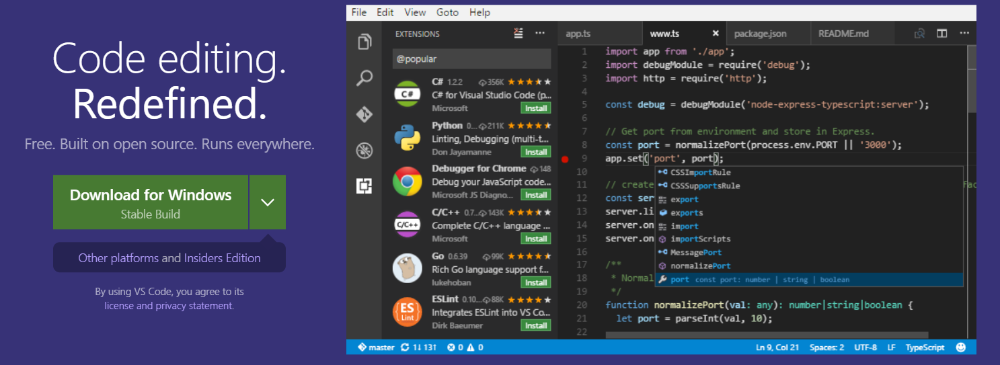
  
ダウンロードされるのをひたすら待つ  
  
* ダウンロードされたexeを実行する  
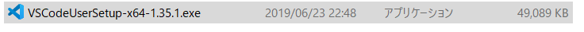
  
* 「次へ」をクリックする  
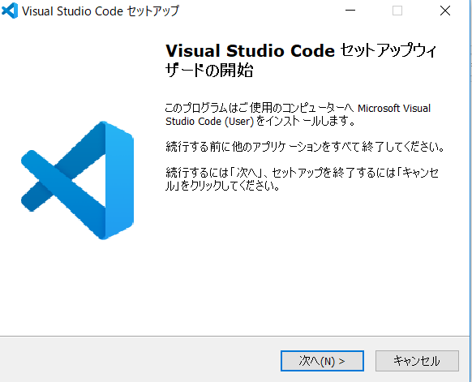
  
* 「同意する」を選択し、「次へ」をクリックする  
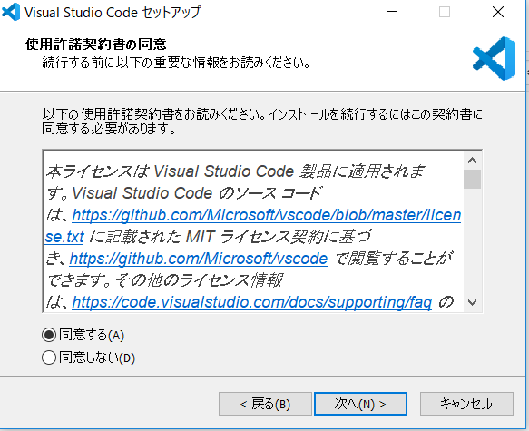
  
* デフォルトのままで「次へ」をクリックする  
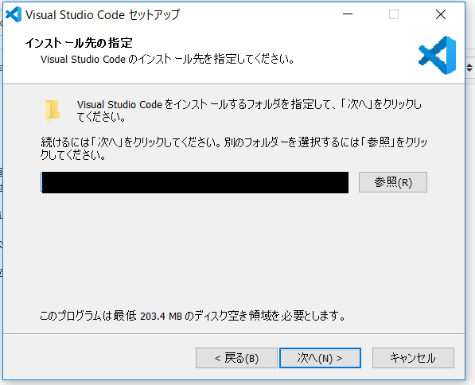
  
* デフォルトのままで「次へ」をクリックする  
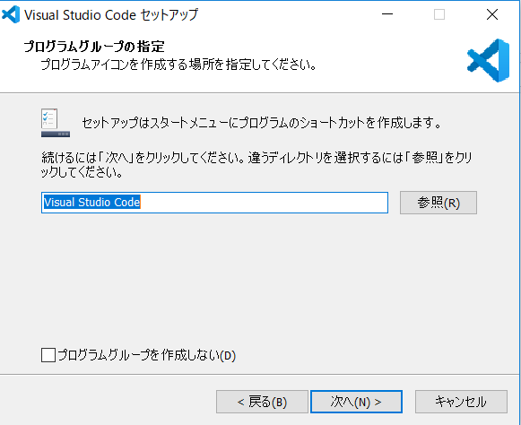
  
* 下図の設定をして、「次へ」をクリックする  
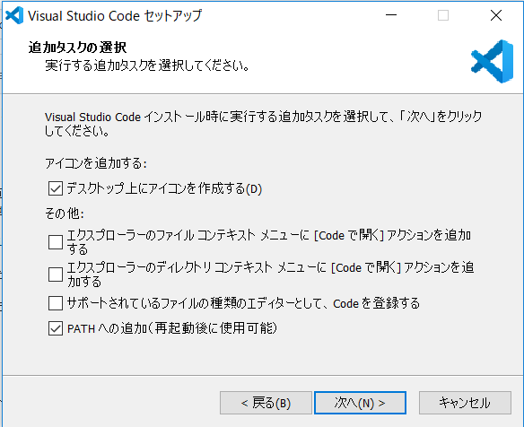
  
* 「インストール」をクリックする  
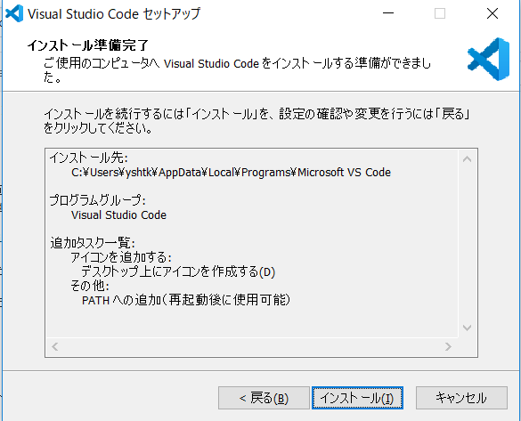
  
* インストールされるのを待つ  
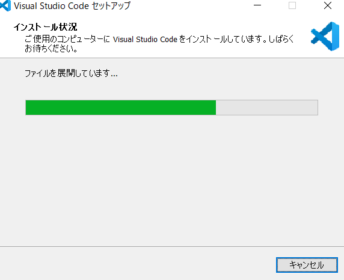
  
* 「完了」をクリックする  
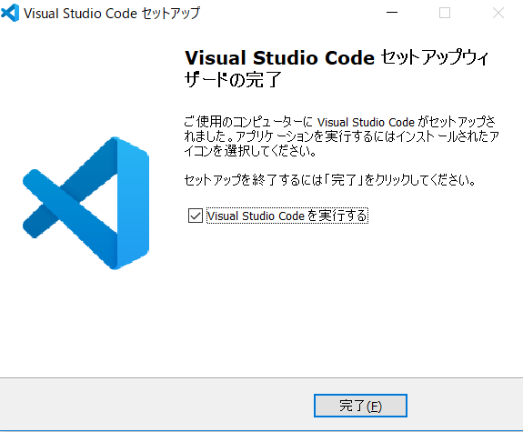
  
* 下図の画面が表示されたら完了  
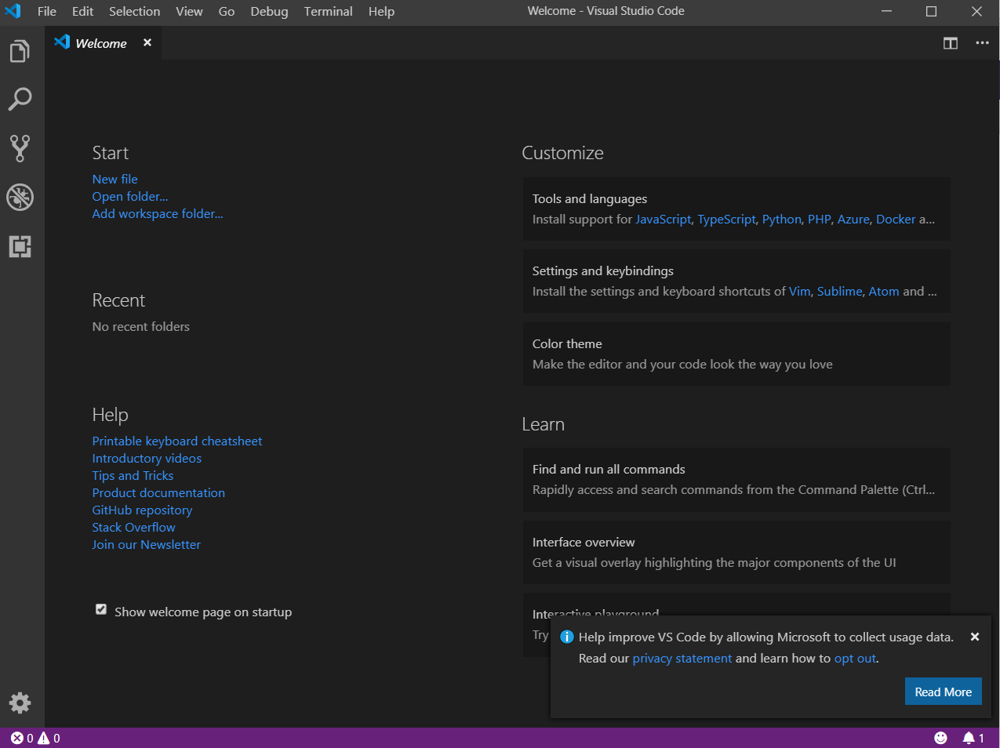

## Git
### Git インストール
* 下記URLをクリックし、画像の「Download」をクリックする
https://gitforwindows.org/
  
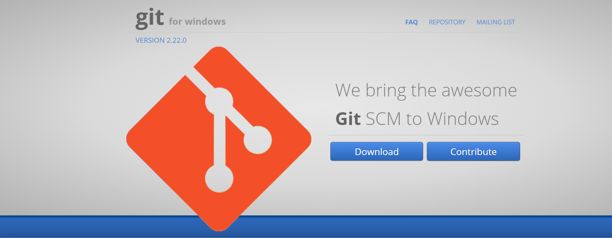
  
ダウンロードされるのをひたすら待つ  
  
* ダウンロードされたexeを実行する


* 「はい」をクリックし、「Next」をクリックする
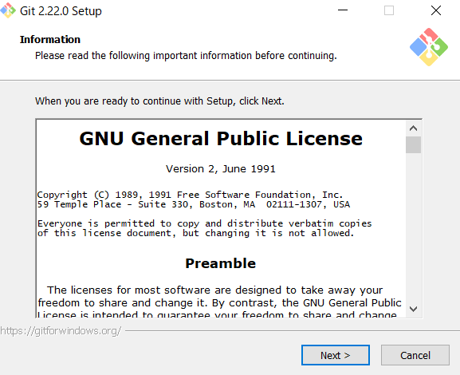
  
* デフォルトのままで「Next」をクリックする  
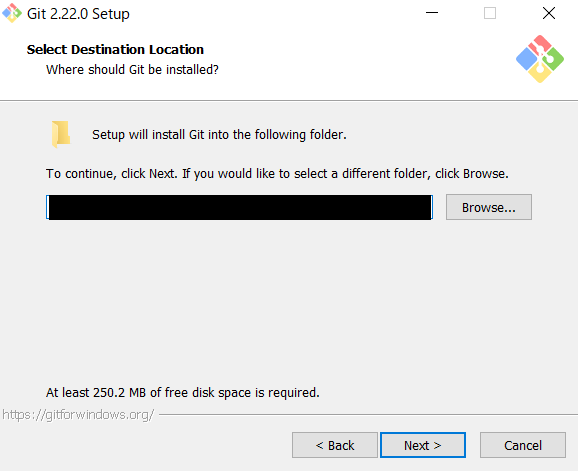
  
* デフォルトのままで「Next」をクリックする  
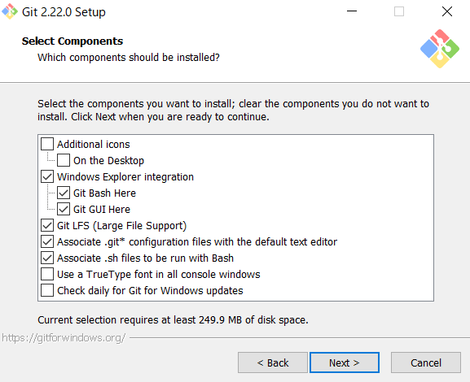
  
* デフォルトのままで「Next」をクリックする  
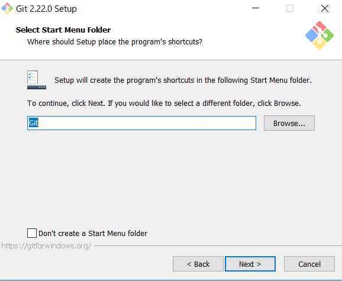
  
* 下図の設定で「Next」をクリックする  
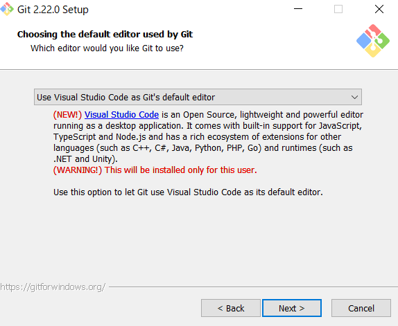
  
* デフォルトのままで「Next」をクリックする  
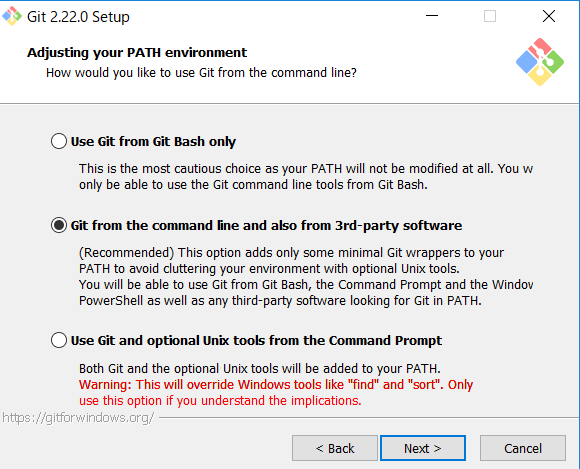
  
* デフォルトのままで「Next」をクリックする  
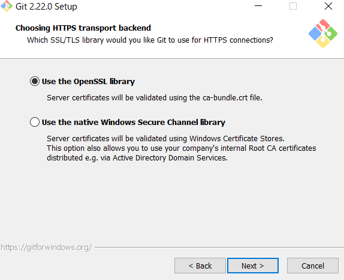
  
* デフォルトのままで「Next」をクリックする  
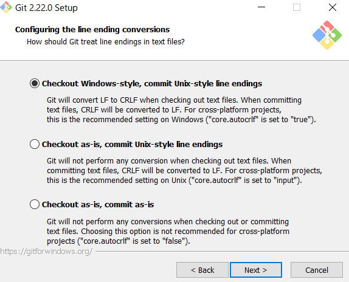
  
* デフォルトのままで「Next」をクリックする  
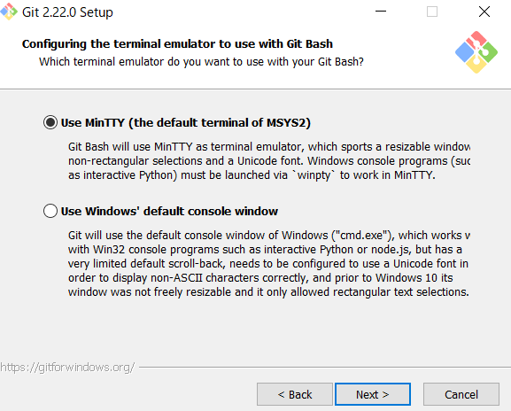
  
* デフォルトのままで「Next」をクリックする  
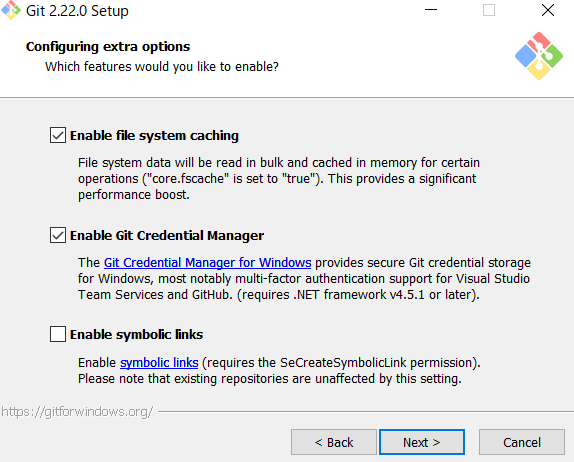
  
* デフォルトのままで「Install」をクリックする  
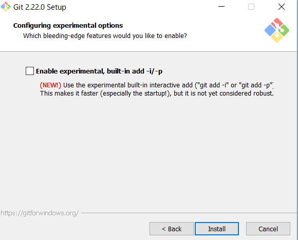
  
* インストールされるのを待つ  
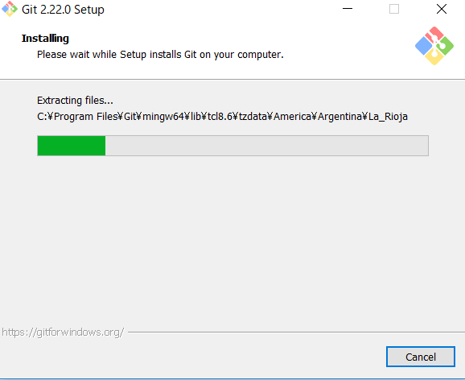
  
* デフォルトのままで「Finish」をクリックする  
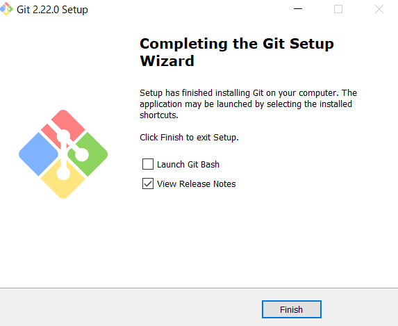

### Git 連携手順
* ローカルリポジトリとするフォルダを開く

* Gitにてローカルリポジトリを作成する

* 「Terminal」→「New Terminal」をクリックする


* 下記コマンドを実行し、ローカルリポジトリとリモートリポジトリを連携する
```
git remote add origin https://github.com/<repo owner>/<repo name>.git
```

* 下記コマンドを実行し、ローカルリポジトリをリモートリポジトリと同期をとる
```
git merge --allow-unrelated-histories origin/master
```

* 編集作業開始

## 拡張機能
### Markdown All in One
* Visual Studio Code を起動して、「表示」→ 「拡張機能」を選ぶ
* テキストボックスに 「markdown」と入力し、「Markdown All in One」をクリックしてインストールする
  
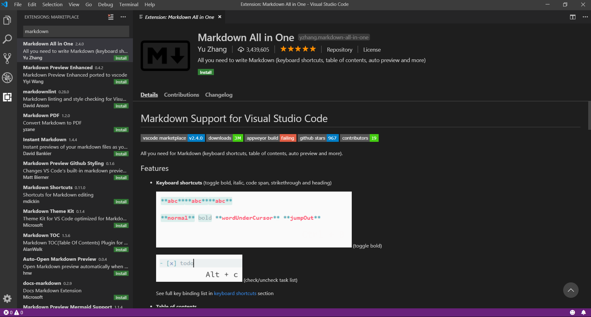
  
  
