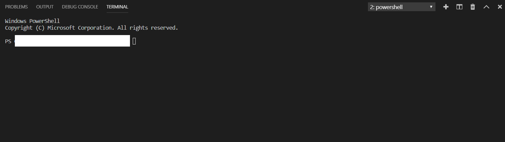
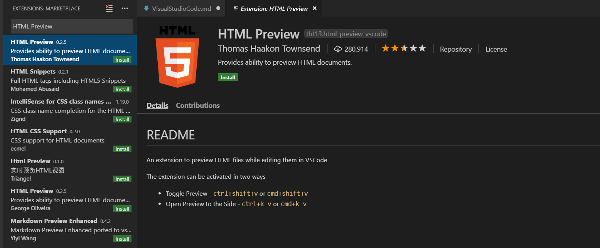
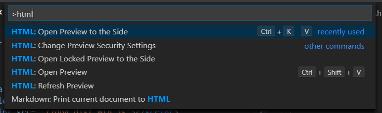
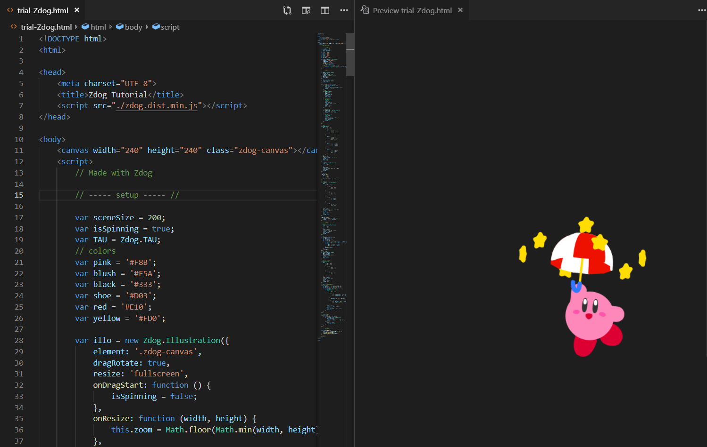
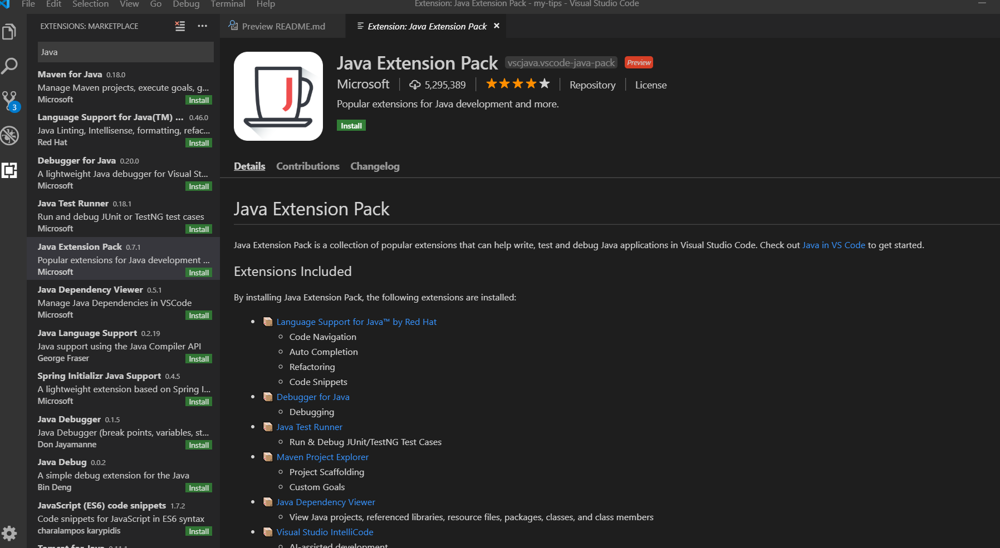
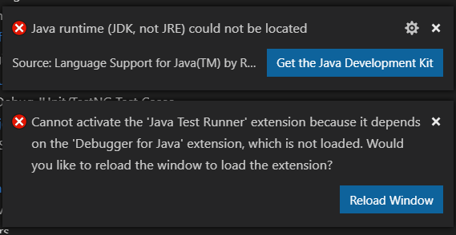
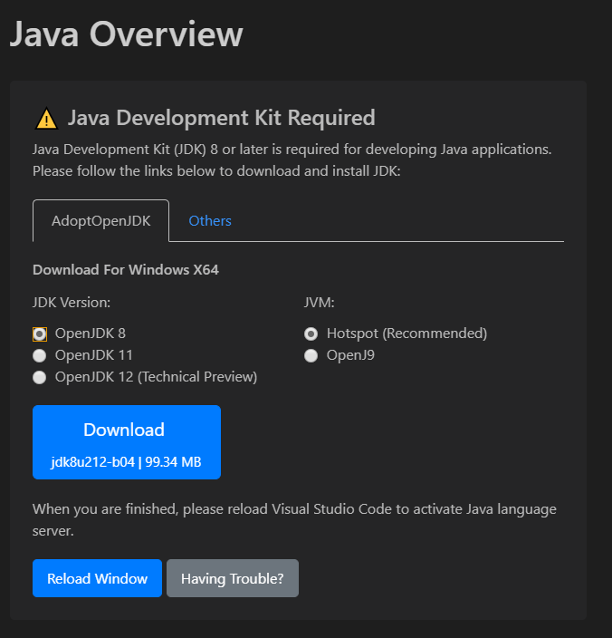
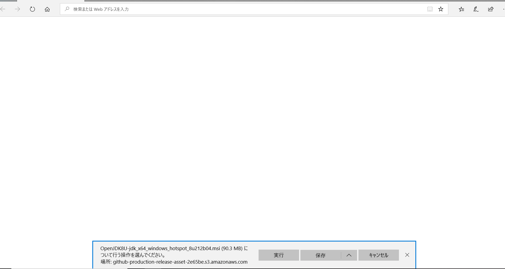
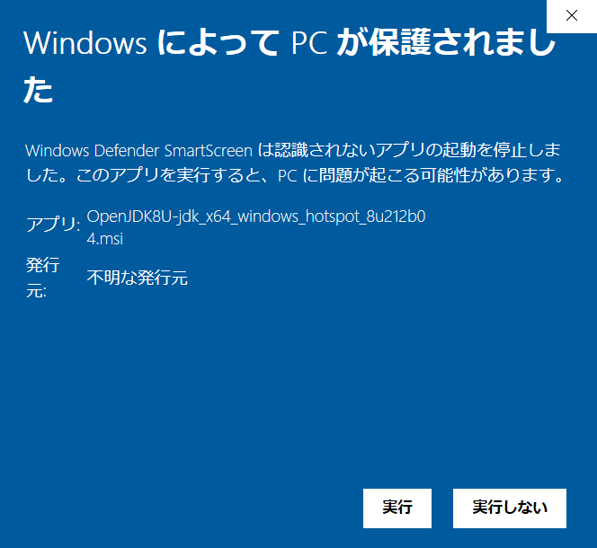

# Visual Studio Code メモ

2019.06.29

- [Visual Studio Code メモ](#Visual-Studio-Code-%E3%83%A1%E3%83%A2)
  - [参考](#%E5%8F%82%E8%80%83)
    - [Git](#Git)
    - [拡張機能](#%E6%8B%A1%E5%BC%B5%E6%A9%9F%E8%83%BD)
  - [環境](#%E7%92%B0%E5%A2%83)
  - [Visual Studio Code インストール](#Visual-Studio-Code-%E3%82%A4%E3%83%B3%E3%82%B9%E3%83%88%E3%83%BC%E3%83%AB)
  - [Git](#Git-1)
    - [Git インストール](#Git-%E3%82%A4%E3%83%B3%E3%82%B9%E3%83%88%E3%83%BC%E3%83%AB)
    - [Git 連携手順](#Git-%E9%80%A3%E6%90%BA%E6%89%8B%E9%A0%86)
  - [拡張機能](#%E6%8B%A1%E5%BC%B5%E6%A9%9F%E8%83%BD-1)
    - [Markdown All in One](#Markdown-All-in-One)
    - [HTML Preview](#HTML-Preview)
    - [Java Extension Pack](#Java-Extension-Pack)

## 参考

### Git
- https://qiita.com/y-tsutsu/items/2ba96b16b220fb5913be
- https://qiita.com/takanatsu/items/fc89de9bd11148da1438
- https://code.visualstudio.com/docs/editor/versioncontrol#_common-questions

### 拡張機能
- https://rui-log.com/vscode-html-cording/
- https://qiita.com/Ninjaky/items/becaa5623eb7607210b4
- https://www.suzu6.net/posts/130-vscode-for-java/

## 環境
- Window Home 10
- Visual Studio Code:1.36.0


## Visual Studio Code インストール
1. 下記URLをクリックし、画像の「Download For Windows」をクリックする
     https://code.visualstudio.com/
     
     ダウンロードされるのをひたすら待つ  
  
2. ダウンロードされたexeを実行する  
     
  
3. 「次へ」をクリックする  
     
  
4. 「同意する」を選択し、「次へ」をクリックする  
     
  
5. デフォルトのままで「次へ」をクリックする  
     
  
6. デフォルトのままで「次へ」をクリックする
     
  
7. 下図の設定をして、「次へ」をクリックする
     
  
8. 「インストール」をクリックする
     
  
9.  インストールされるのを待つ  
     
  
10. 「完了」をクリックする
     
  
11.  下図の画面が表示されたら完了  
     

## Git
### Git インストール
1. 下記URLをクリックし、画像の「Download」をクリックする
     https://gitforwindows.org/
     
     ダウンロードされるのをひたすら待つ  
  
2. ダウンロードされたexeを実行する
     

3. 「はい」をクリックし、「Next」をクリックする
     
  
4. デフォルトのままで「Next」をクリックする
     
  
5. デフォルトのままで「Next」をクリックする
     
  
6. デフォルトのままで「Next」をクリックする
     
  
7. 下図の設定で「Next」をクリックする
     
  
8. デフォルトのままで「Next」をクリックする
     
  
9. デフォルトのままで「Next」をクリックする
     
  
10. デフォルトのままで「Next」をクリックする
     
  
11. デフォルトのままで「Next」をクリックする
     
  
12. デフォルトのままで「Next」をクリックする
     
  
13. デフォルトのままで「Install」をクリックする
     
  
14. インストールされるのを待つ
     
  
15. デフォルトのままで「Finish」をクリックする
     

### Git 連携手順
1. ローカルリポジトリとするフォルダを開く

2. Gitにてローカルリポジトリを作成する

3. 「Terminal」→「New Terminal」をクリックする
     

4. 下記コマンドを実行し、ローカルリポジトリとリモートリポジトリを連携する
    ```
    git remote add origin https://github.com/<repo owner>/<repo name>.git
    ```

5. 下記コマンドを実行し、ローカルリポジトリをリモートリポジトリと同期をとる
    ```
    git merge --allow-unrelated-histories origin/master
    ```

6. 編集作業開始

## 拡張機能
### Markdown All in One
1. 「拡張機能」で 「markdown」と入力し、「Markdown All in One」をクリックしてインストールする
  
    
  
### HTML Preview
1. 「拡張機能」で 「HTML」と入力し、「HTML Preview」をクリックしてインストールする

    

2. コード編集画面にて「Ctrl + Shift + P」で下図を開き、「HTML:Open Preview to the Side」を選択すると、プレビュー画面が表示される

    

    

### Java Extension Pack

1. JDKを下記手順でインストール
   
2. 「拡張機能」で 「Java」と入力し、「Java Extension Pack」をクリックしてインストールする

    

3. 下図のエラーが出たので、「ReloadWindow」をクリック

    

4. 下図のJava Overviewで対象のJDKをダウンロード。今回はJDK8をダウンロード。

    

5. 下図の画面が表示されるので、「実行」をクリック。

    

   - 実行すると下図が出るため「実行」をクリック

    


