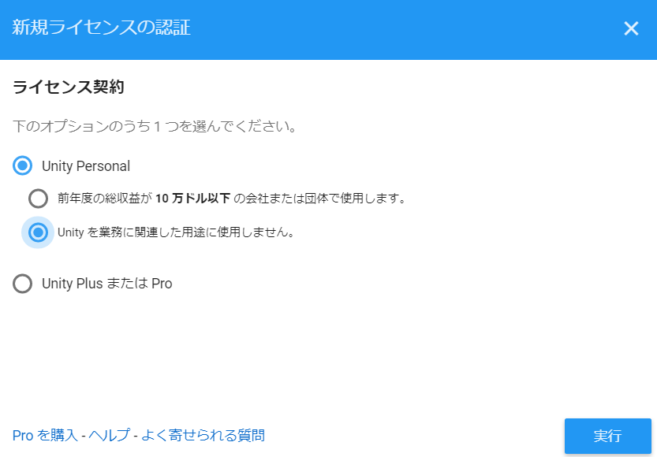

- [Reference](#reference)
- [Development Environment](#development-environment)
- [Setup](#setup)
  - [UnityHub Unity](#unityhub-unity)
  - [Android Studio](#android-studio)
  - [Android SDK & Android NDK](#android-sdk--android-ndk)
  - [ARCore SDK for Unity&Multiplayer HLAPI&XR Legacy Input Helpers](#arcore-sdk-for-unitymultiplayer-hlapixr-legacy-input-helpers)
  - [HelloAR](#helloar)
    - [HelloARをAndroid端末でビルドする](#helloar%e3%82%92android%e7%ab%af%e6%9c%ab%e3%81%a7%e3%83%93%e3%83%ab%e3%83%89%e3%81%99%e3%82%8b)
    - [TODO](#todo)

# Reference
- [ARCore by Google](https://developers.google.com/ar/)
- [【Unity】ARCoreでARアプリ開発 – 環境構築から実装まで徹底解説！](https://xr-hub.com/archives/14427)
- [ARCore 取扱説明書](https://qiita.com/taptappun/items/a5337d29a43d5d673c7f)
- [ARアプリ開発初心者必見！Unity・Vuforiaの活用と環境構築フロー](https://xr-hub.com/archives/719)
- [ARCoreをUnity で開発（２.Unity 2019でサンプルを動かす）](https://qiita.com/takaf04/items/b4accb27d2ede69b7937)

# Development Environment
- Window Home 10
- UnityHub 2.0.4
- Unity 2019.1.11
- Android Studio 3.4.2 for Windows 64-bit
- ARCore SDK for Unity v1.10.0

# Setup
## UnityHub Unity
- UnityHubダウンロード
  - [Unity](https://unity3d.com/jp/get-unity/update/)
  - 
- ダウンロードした「UnityHubSetup.exe」を実行
- 「同意する」をクリック
  - 
- 「インストール」をクリック
  - 
- 「完了」をクリック
  - 
- 「アクセスを許可する」をクリック
  - 
- 
- 「ライセンスリクエストを保存」をクリックし、「次へ」をクリック
  - 
- さっき保存したラインセンスリクエストをアップロード
  - 
  - NG
- 画面下図のログインをGoogleアカウントでログイン
- 「新規ライセンスの認証」をクリック
  - 
- 下図を選択し、「実行」をクリック
  - 
- ここまででUnityHubセットアップ完了
- 「インストール」をクリック
  - 12
- 「Unity 2019.1.11f1」を選択し、「次へ」をクリック
  - 13
- 下図を選択し、「次へ」をクリック
  - 14
  - 15
- 下図を選択し、「実行」をクリック
  - 16
- インストールが完了するまで待つ
  - 17
- 下図になったらインストール完了
  - 18

## Android Studio
- Android Studioダウンロードをクリック
  - 1
- チェックしてダウンロード
  - 2
- ダウンロードした「android-studio-ide-183.5692245-windows.exe」を実行
- 「Next」をクリック
  - 3
- 「Next」をクリック
  - 4
- 「Next」をクリック
  - 5
- 「Install」をクリック
  - 6
- インストールが完了するまで待つ
  - 7
- 「Next」をクリック
  - 8
- 「Finish」をクリック
  - 9
- 「OK」をクリック
  - 10
- 「Don't Send」をクリック
  - 11
- 「Next」をクリック
  - 12
- 「Next」をクリック
  - 13
- 「Next」をクリック
  - 14
- 「Finish」をクリック
  - 15
- セットアップが完了するまで待つ
  - 16
- 「Finish」をクリック
  - 17
- Android Studioが起動し完了
  - 18

## Android SDK & Android NDK
- Android Studioを起動
- 「Configure」→「SDK Manager」をクリック
  - 1
- 下図チェックし、「OK」をクリック
  - 2
  - 3
- 「OK」をクリック
  - 4
- 「Next」をクリック
  - 5
- インストールが完了するまで待つ
  - 6
- 「Finish」をクリック
  - 7

## ARCore SDK for Unity&Multiplayer HLAPI&XR Legacy Input Helpers
- [GitHub](https://github.com/google-ar/arcore-unity-sdk/releases)から、最新の「arcore-unity-sdk-v*.*.*.unitypackage」をダウンロード
  - 今回はarcore-unity-sdk-v1.10.0.unitypackage
  - 1
  - 2
- Unityプロジェクトを新規作成する
  - 3
  - 4
- ツールバー「ウィンドウ」から、「Package Manager」を開く
- 「Multiplayer HLAPI」を選んで、Install
  - 5
- 「XR Legacy Input Helpers」を選んで、Install
  - 6
- 「arcore-unity-sdk-v1.10.0.unitypackage」のパッケージの中身全てをインポートする
  - 7
  - 8
- 完了

## HelloAR
### HelloARをAndroid端末でビルドする
- 「Assets/GoogleARCore/Examples/HelloAR/Scenes/HelloAR」から「シーンを追加」を押し「HelloAR」が選択されていることを確認する
  - 1
  - 2
- ツールバーの「ファイル」から「ビルド設定」を開き、プラットフォームで「Android」を選択し「Switch Platform」を押す
- 「プレイヤー設定」をクリックし、上部にある「企業名」や「プロダクト名」を変更する
  - 3
- 「Other Settings」で「最低APIレベル」と「ターゲットAPIレベル」を「Android 9.0 (API Level 28)」を選択する
  - ※本当は 「Android 7 (API Level 28)」 を選びたいが、UnityHubからSDKをインストールした場合の追加方法が分からないので9.0を選択しました。（現在、対応方法を検索中・・・）
  - 4
- 「XR Settings」で ARCore Supported： 有効化
  - 5
- 上記警告の対応の為に、「その他の設定」に戻り、「Graphics APIs」から「Vulkan」を削除
  - 6
- ※Andoroidだとbuildエラーが発生中
  - Unityを管理者として実行するとできるかも→できない・・・
  - ファイアウォール設定の画面がでてくるかもしれない
  - もう一回実行したらできた
  - とりあえず・・・スマホがARCoreの非対称だった

### TODO
